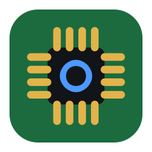
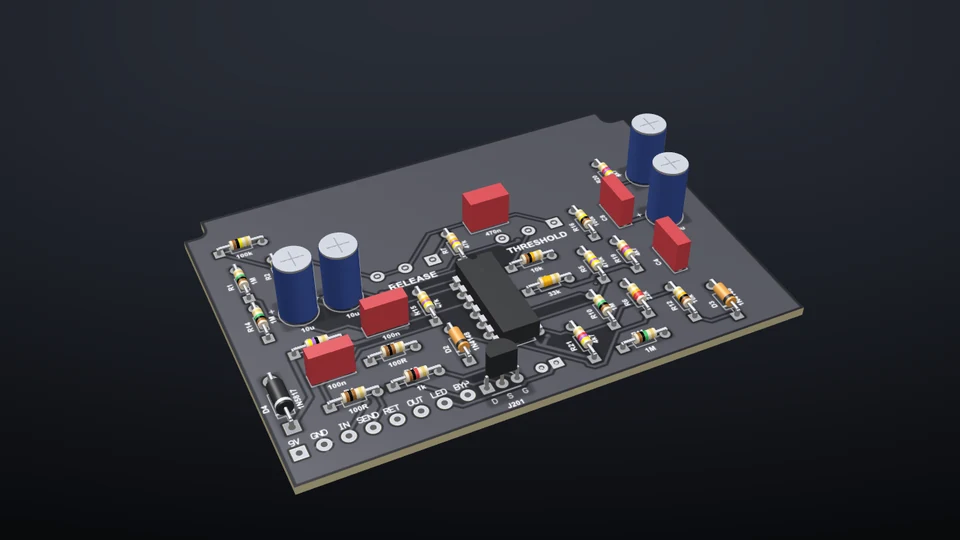

<p align="center">
  
</p>

<h1 align="center">PCBPro</h1>

<p align="center">
  <b>PCB design for guitar pedals, tube amps and everything else.</b><br>
  Lay out the board, see it in 3D, run the circuit and play your guitar through it before you build it, then order the boards and the parts.
</p>

<p align="center">
  <a href="https://gjnail.github.io/pcbpro/"><b>Website</b></a> ·
  <a href="https://github.com/gjnail/pcbpro/releases/latest"><b>Download</b></a> ·
  <a href="docs/getting-started.md"><b>Install</b></a> ·
  <a href="docs/tutorial.md"><b>Tutorial</b></a> ·
  <a href="https://gjnail.github.io/pcbpro/guides.html"><b>Guides</b></a> ·
  <a href="https://gjnail.github.io/pcbpro/#listen"><b>Listen</b></a>
</p>

<p align="center">
  <a href="https://ko-fi.com/gnail"></a>
  <a href="LICENSE"></a>
  <a href="https://github.com/gjnail/pcbpro/actions/workflows/ci.yml"></a>
  
  
</p>

<p align="center">
  <a href="https://gjnail.github.io/pcbpro/#showreel"></a><br>
  <sub>The bundled three-knob overdrive, in PCBPro's 3D view. <a href="https://gjnail.github.io/pcbpro/#showreel">Watch the showreel</a>.</sub>
</p>

PCBPro is a desktop app for designing printed circuit boards, with everything a guitar-pedal or amp builder needs built in. A wizard shapes a pedal board for its Hammond box and drills the box from the board. The Amp Designer turns a description ("modern high gain, 50 W, tight, with an effects loop") into a complete circuit, the transformers to buy, and a routed board with high-voltage spacing from IPC-2221B. Its own circuit simulator runs the board, from a blinking LED to an Arduino running your compiled firmware to a five-stage tube preamp you can play through with your own guitar. When it's right, it exports the Gerbers, compares four fabs and makes the shopping list.

It's a native app built with Qt and OpenGL: no browser, no account, no cloud, and nothing else to install.

| | |
|---|---|
| **Pedals** | Nine Hammond enclosures, a new-pedal wizard, mirrored drilling, a 1:1 drill template, Tayda coordinates, enclosure checks, a build sheet |
| **Amps** | The Amp Designer, amp templates, tubes in 3D, IPC-2221B high-voltage rules, amp checks, a tone stack designer |
| **Simulation** | Analog parts, tubes, logic, AVR microcontrollers running real firmware, an oscilloscope; play your guitar through it live |
| **Layout** | A 45° router, an autorouter, copper pours, net classes, a design rule check |
| **Parts** | 1,200+ generated footprints, ~265 catalogue parts, any LCSC part, the KiCad library, a footprint wizard, checks against datasheets |
| **Ordering** | Gerbers and drills, BOM and pick-and-place, JLCPCB / PCBWay / OSH Park / AISLER compared, a shopping list at eight shops |

## A tour

### Guitar pedals

 

**Pedal › New pedal…** asks for a box, the knobs, the jacks and an LED, and draws a board shaped for the box: notched around the screw bosses, the pots at the knob positions, power filtering and a 4.5 V bias, labelled wire pads and a ground pour. Pots hang under the board, so the enclosure face sees it mirrored; PCBPro does that arithmetic and drills the box from the board. The checks make sure the board, every part, the knobs and the jacks fit and clear each other. [The pedal guide](docs/pedals.md)


### The Amp Designer


Describe the amp you want: guitar or bass, tube or solid state, a voicing from Blackface clean and Tweed breakup through Plexi crunch to five-stage extreme high gain, a power stage from a 5 W Champ to a 100 W four-EL34 head, and the features. The designer assembles a proven circuit and works out the operating point of every tube and B+ node, the transformers, choke and fuse to buy, the gain of each stage and where the volume knob breaks up, a first power-up checklist and a voltage chart for troubleshooting. **Build my amp** places and routes the board. [The Amp Designer](docs/amp-designer.md)

### High-gain amps and metal pedals

 

Three cascaded-preamp voicings in the spirit of the JCM800, the SLO-100 and the 5150, with a tightness control that sets how much bass reaches the distortion (fat, normal, tight, djent), a depth control on the feedback loop, a tube-buffered effects loop and DC heaters. An analysis shows where each stage clips and how much hiss the gain brings up. Three pedals go with them, each a complete pedal with its box and routed board: a Tight Boost, a 4-cable Noise Gate and a High-Gain Distortion. [High-gain amps and metal pedals](docs/high-gain.md)

**Hear them** on the [website](https://gjnail.github.io/pcbpro/#listen): the voicings, the tightness settings and the pedals, rendered by PCBPro's tube simulation.

### Run the board


Press **Run** (F5) and the board comes alive: LEDs light and blink, copper is tinted by its voltage, overstressed parts smoke, and buttons, switches and pots work. Double-click a net to probe it on the oscilloscope. It simulates resistors to op-amps and 555s, about 220 real parts by part number, 74HC and CD4000 logic, vacuum tubes with models calibrated to their datasheets, whole amp boards with their transformer and speaker, and ATmega and ATtiny chips running your **real compiled firmware**, with a serial monitor. *As built* mode follows the copper, so a missing track really leaves the LED dark. [Running the board](docs/simulation.md) · [Microcontrollers and firmware](docs/firmware.md)

### Play guitar through it

 

**Play live** runs your guitar through the circuit in real time, with about 10 ms of latency through an audio interface, and the pedal's or amp's own knobs to turn while you play. The board is compiled into a nodal DK state-space model, the approach amp-sim plugins use, with only the diodes, transistors, op-amps and tubes solved per sample. **Audio play-through** renders a clip so you can compare dry and processed, and four public-domain speaker cabinets (or your own IRs) go after the circuit with no added latency. [Playing guitar through it](docs/audio.md)

### The layout editor

 

Place parts and connect their pads straight on the board (there's no separate schematic), then route with a 45° interactive router that shows clearance problems as you go, or with the autorouter. Copper pours refill after every edit, net classes set widths and clearances, and the design rule check catches clearance problems, shorts, thin tracks, small drills and annular rings, edge clearance, courtyard overlaps and unrouted connections. [The layout editor](docs/layout.md)

### Over a million parts

 

1,200+ generated footprints in every size and pin count, about 265 real parts by manufacturer part number, any of LCSC's million-plus parts by its C-number, and the official KiCad library's 15,000+ footprints in one click. A wizard builds anything else from datasheet dimensions. Footprints are checked pad by pad against KiCad's datasheet-based library, and every part gets a 3D model. [The parts library](docs/library.md)

### In 3D

 

The board as it will be made, with its mask, finish and silkscreen, and a 3D body on every part. Tubes stand in their sockets with glass, plates and glowing heaters; pedals sit in their powder-coated boxes. [The 3D view](docs/3d-view.md)

### Order it

 

Gerbers, drill files, BOM and pick-and-place in one click, checked against JLCPCB, PCBWay, OSH Park and AISLER with estimated prices and delivery, then the fab's upload page. **Buy parts** makes the shopping list, grouped the way you shop, with a search link at Digi-Key, Mouser, LCSC, Farnell, Tayda, Small Bear, Love My Switches or Das Musikding, and can send a pedal's holes to Tayda's drilling service. [Manufacturing](docs/manufacturing.md) · [Buying components](docs/buying-parts.md)

## Get started

**Windows:** download `PCBPro-<version>-windows-x64.zip` from the [latest release](https://github.com/gjnail/pcbpro/releases/latest), unzip it anywhere and run `PCBPro.exe`. No installer, no account.

**From source** (Windows, macOS, Linux), with Python 3.10 or newer:

```bash
git clone https://github.com/gjnail/pcbpro.git
cd pcbpro
```

Then double-click `PCBPro.bat` on Windows, or run `./pcbpro.sh` on macOS or Linux. The first run creates a private Python environment and installs the dependencies. [Install and first steps](docs/getting-started.md) has the details, including building the Windows app yourself.


The start screen offers a new pedal, a new amp, a new board, and the examples. The [tutorial](docs/tutorial.md) builds a three-knob overdrive from an empty enclosure to an order in about 45 minutes, and [11 examples](docs/examples.md), from a 555 flasher to a 100 W five-stage amp, are ready to open, run and play.

## Documentation

| Guide | What is in it |
|---|---|
| [Install and first steps](docs/getting-started.md) | Requirements, install, the window, a board in six steps, where things are kept |
| [Tutorial: your first pedal](docs/tutorial.md) | A three-knob overdrive from the enclosure to the order |
| [Examples](docs/examples.md) | The 11 bundled projects |
| [The layout editor](docs/layout.md) | The board, tools, the netlist, routing, the autorouter, pours, net classes, DRC |
| [The parts library](docs/library.md) | Built-in footprints, the catalogue, LCSC import, KiCad libraries, the wizard, footprint checks |
| [The 3D view](docs/3d-view.md) | Navigation, finishes, pedals in their boxes, tubes, glowing LEDs |
| [Guitar pedals](docs/pedals.md) | The wizard, enclosures, mirroring, drilling, enclosure checks, pedal parts, the build sheet |
| [The Amp Designer](docs/amp-designer.md) | Voicings, power stages, features, the spec sheet, tone, Listen, building the board |
| [High-gain amps and metal pedals](docs/high-gain.md) | Three voicings, tightness, depth, the loop, DC heaters, gain staging, three metal pedals |
| [Amp boards and high voltage](docs/amps.md) | Templates, tubes and sockets, IPC-2221B rules, amp checks, tone stacks, calculators, safety |
| [Running the board](docs/simulation.md) | Run mode, the oscilloscope, sources, what's simulated, tubes, amp boards, logic |
| [Microcontrollers and firmware](docs/firmware.md) | ATmega and ATtiny chips running .hex files, the serial monitor, NeoPixels |
| [Playing guitar through it](docs/audio.md) | Play live, audio play-through, the frequency response, speaker cabinets |
| [Manufacturing and ordering](docs/manufacturing.md) | Pre-flight checks, the fab comparison, Gerbers and drills, BOM and CPL, assembly |
| [Buying components](docs/buying-parts.md) | The shopping list, eight shops, BOM upload, Tayda drilling |
| [Shortcuts and command line](docs/shortcuts.md) | Every key, `--selftest`, the scripts in `tools/` |
| [How it works](docs/how-it-works.md) | The model, pours, the autorouter, the simulator, tubes, the AVR emulator, real-time audio, the tests |
| [Troubleshooting and limits](docs/troubleshooting.md) | Common fixes, known issues, and what it doesn't do yet |

The same guides, with full-quality video, are on the [website](https://gjnail.github.io/pcbpro/).

## How it works

PCBPro is Python: a Qt (PySide6) app with an OpenGL 3D view, Shapely for copper geometry, and NumPy for its circuit simulator, a modified-nodal-analysis engine with Newton iteration, adaptive time steps and exact event landing. Tubes use Koren's equations calibrated to their datasheet bias points; AVRs are emulated cycle by cycle; the real-time audio model is a nodal DK state-space model whose per-sample loop is compiled with numba. The autorouter is an A* grid router. [How it works](docs/how-it-works.md) has the details.

About 1,850 tests check it: footprints against KiCad's datasheet-based library, Gerbers against an independent parser, every Amp Designer combination, amp boards for a clean DRC, tube models against their datasheets, the real-time model against the offline simulator, and the UI end to end.

```bash
pip install -r requirements.txt pytest pygerber
python -m pytest tests
```

## Contributing

Bug reports, footprints, enclosures, simulation models, pedal and amp designs and pull requests are welcome. [CONTRIBUTING.md](CONTRIBUTING.md) has the rules for parts, checks and models (real numbers with a source, checked against something independent, never loosening a safety check without a reference), how to build and test, and the source layout. The guides live in [`docs/`](docs) as Markdown and the website is built from them, so a change to a feature and its guide can go in the same pull request. Questions and finished builds go in [Discussions](https://github.com/gjnail/pcbpro/discussions).

Please report anything that could make PCBPro run code from a file, or write or delete files it shouldn't, privately. [SECURITY.md](SECURITY.md) says how. Participation is covered by the [Code of Conduct](CODE_OF_CONDUCT.md).

## A word on safety

Tube amps run at lethal voltages. PCBPro's high-voltage rules follow IPC-2221B and common practice, but they don't replace a safety standard (IEC 62368-1 / UL) for mains wiring. Keep the mains on the chassis, check the bleeders, and measure before you touch anything. Check footprints and hardware against your actual parts, and the fab's Gerber viewer, before you order. Prices shown are estimates; the fab's quote is what you pay.

## Support

PCBPro is free. If it saved you a board, a box or a blown fuse and you'd like to say thanks, you can
[buy me a coffee on Ko-fi](https://ko-fi.com/gnail).

## License

[MIT](LICENSE). Third-party material:

- The four built-in cabinet impulse responses in `pcbpro/resources/irs` are public domain, from the "650 Assorted Cabinet Impulses" pack by zoyd on musical-artifacts.com (see `pcbpro/resources/irs/README.txt`).
- The [Barlow](https://github.com/jpt/barlow) font used on the website is under the SIL Open Font License.
- The official KiCad footprint library isn't included: PCBPro downloads it when you ask, under the KiCad libraries' own license (CC-BY-SA 4.0 with an exception for designs made with it).
- The Windows download bundles Qt (LGPL), Python and other libraries; their licenses are in `THIRD-PARTY-LICENSES.txt` in the download.
