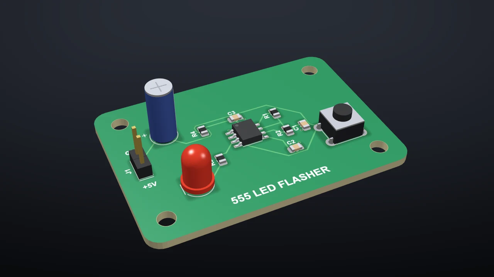
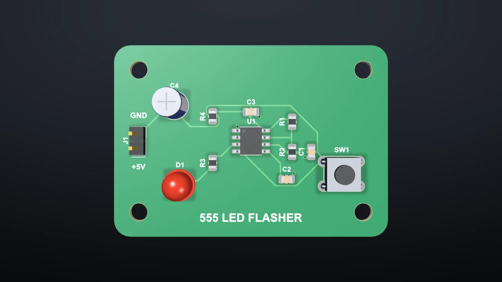
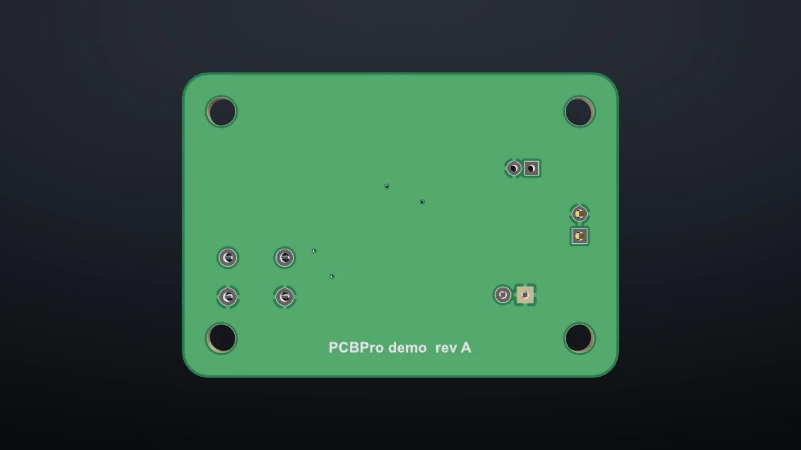
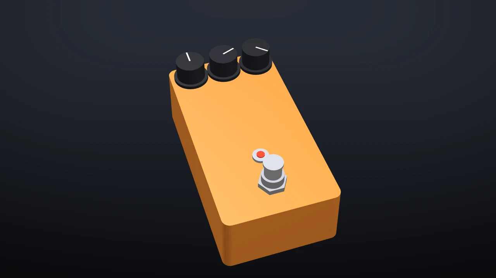
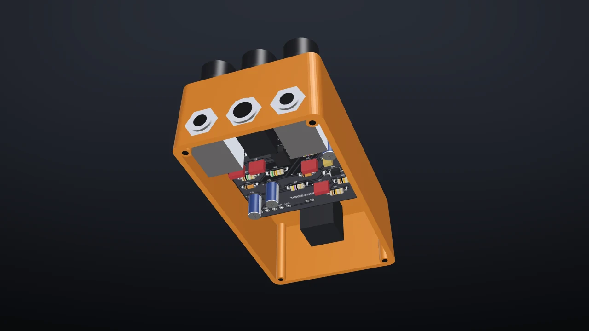
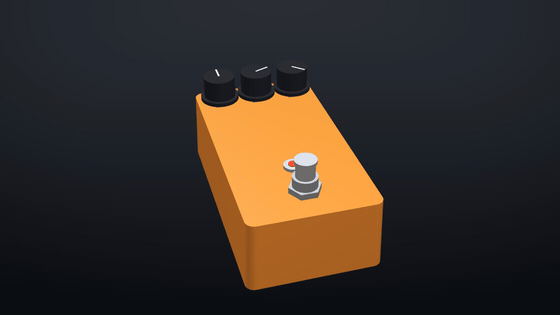
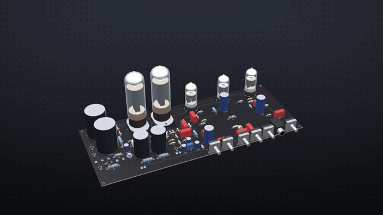
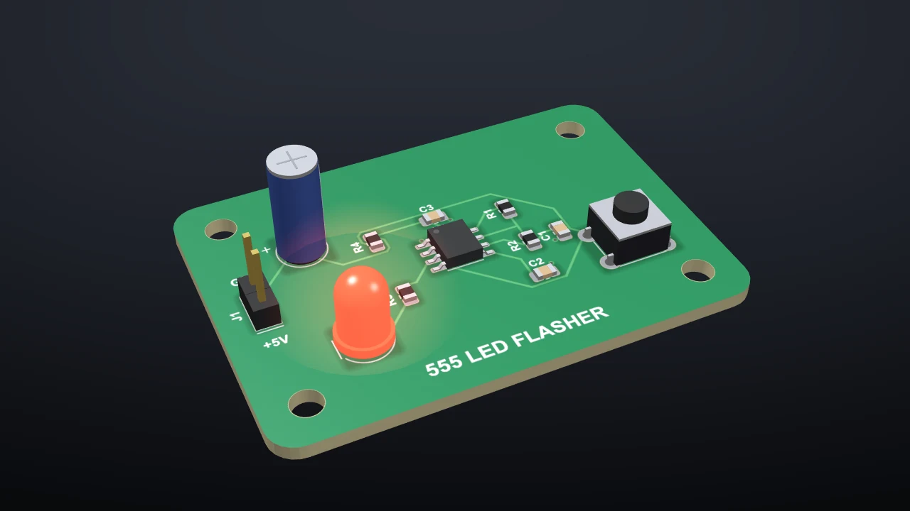

# The 3D view

A real-time OpenGL view of the board as it will be made: the solder mask, the copper under it, the exposed finish, the silkscreen, plated holes and the board edges, with a 3D body on every part. Pedals show their enclosure, and amps their tubes.

Open it with the **3D View** tab, the **3D** button, or **F3** (press it again to go back to the layout). It follows every edit as you make it.

## Moving around

| Do this | To |
|---|---|
| Left-drag | Orbit |
| Right-drag, middle-drag or Shift + left-drag | Pan |
| Wheel | Zoom |
| Double-click or Home | Fit the board |
| 1 / 2 / 3 / 0 | Top / bottom / front / iso |
| 4 / 6 / 8 | Left / right / back |

The **Iso**, **Top**, **Bottom** and **Front** buttons do the same as the keys.

## What's drawn

- **The board.** The FR-4 core at its real thickness, the solder mask in its colour with the copper showing through it slightly, pads and exposed copper in the surface finish (HASL is silvery, ENIG gold, OSP copper), the silkscreen, plated and unplated holes, and the board outline with its cut-outs.
- **Parts.** Every footprint gets a body made from its family and dimensions: chip resistors and capacitors, ICs with gull-wing leads, QFNs with their pads, DIPs, headers, JST and terminal-block connectors, tactile switches, radial electrolytics, crystals, TO-220 and TO-92 packages, axial resistors with colour bands that spell their value, LEDs in the colour named by their value, USB-C sockets. Footprints imported from LCSC or KiCad get a body from their outline. Untick **Components** to see the bare board.
- **The finish.** The **Mask**, **Silk** and **Finish** boxes change the colours live. They're the same settings as on the order page.

| Top | Bottom |
|---|---|
|  |  |

## Pedals

Tick **Pedal enclosure** to draw the box in its powder coat, with the knobs, the footswitch, the LED bezel and the jack nuts where the drill template puts them. **Pedal view** turns it knobs-up even when the pots hang under the board, which they usually do. **Base plate** closes the box from below; leave it off and turn the box over to check that the board, the jacks and the tallest caps fit inside.

| Pedal view | From below, open |
|---|---|
|  |  |

## Amps

A tube socket valued with a tube type ("12AX7", "EL84", "6L6GC") draws that tube standing in it: a transparent glass envelope over the plates, the mica spacers, the silver getter flash at the top and glowing heaters. 24 tube types are included (see [Amp boards](amps.md#tubes-on-sockets)).

## While the simulation runs

LEDs glow in the 3D view at the brightness the simulation gives them, so a blinking LED blinks in 3D too. See [Running the board](simulation.md).

## Screenshots

**Screenshot…** saves the 3D view as a PNG at the window's size. Make the window bigger first for a bigger picture.
