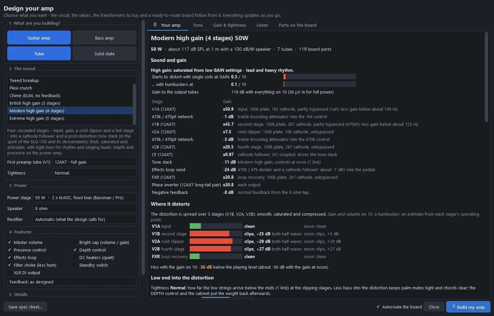
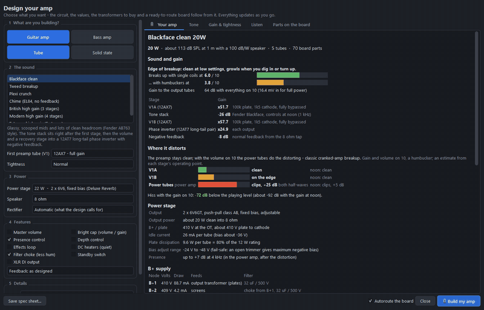
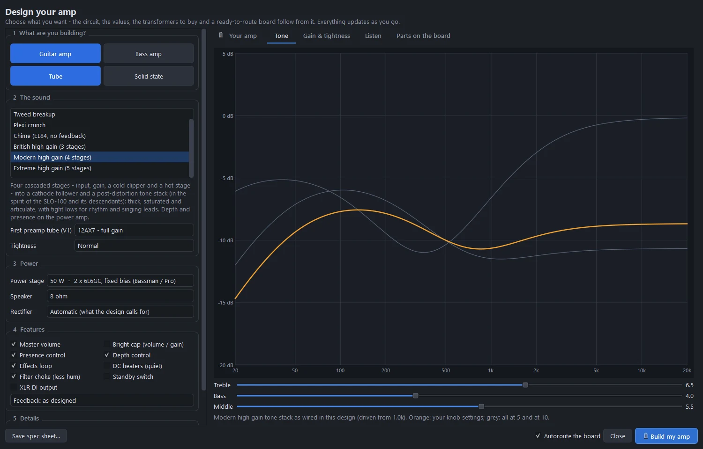
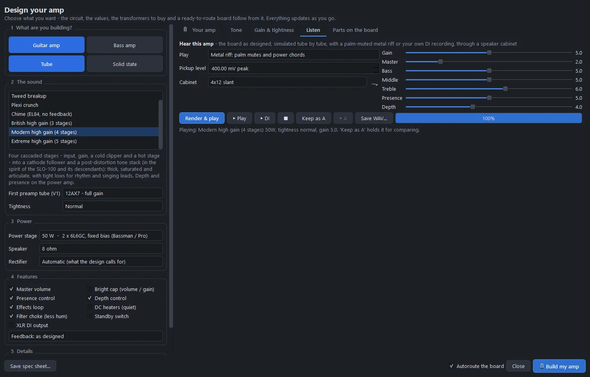
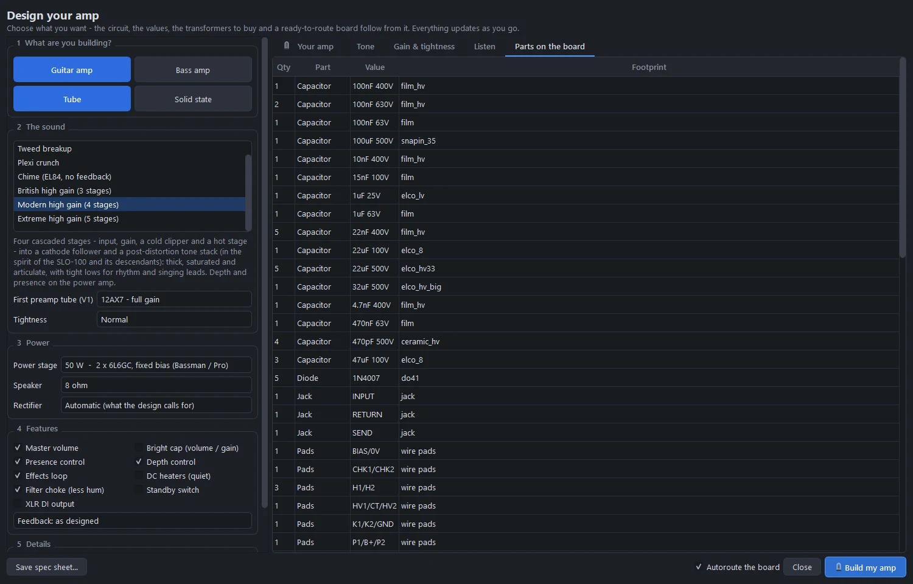
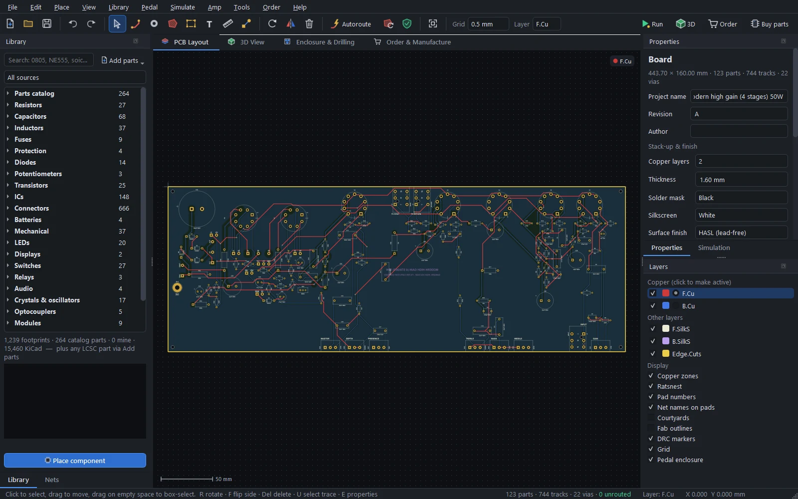

# The Amp Designer

Describe the amp you want, and the Amp Designer gives you the whole build: a proven circuit with every value picked, the operating points, the transformers to buy, how much gain it has and where it breaks up, a voltage chart for troubleshooting, a sound you can listen to, and a placed and routed board.

Open it with **Amp › Amp Designer…** (Ctrl+Alt+A), or **New amp (guitar / bass)…** on the start screen. Reopening it on a board it built loads that board's choices again.

## Choosing the amp

Everything on the left updates the right-hand side live.

### What are you building?

**Guitar amp** or **Bass amp**, **Tube** or **Solid state**.

### The sound

| Voicing | Character |
|---|---|
| **Blackface clean** | Glassy, scooped mids and lots of clean headroom (Fender AB763 style). The tone stack sits right after the first stage, then the volume and a recovery stage into a 12AT7 long-tail phase inverter with negative feedback. |
| **Tweed breakup** | Raw, mid-forward and touch-sensitive; breaks up early (5E3 / 5F1 style). Two gain stages, a single treble-cut tone control and a cathodyne phase inverter, no negative feedback. |
| **Plexi crunch** | Bright, punchy British crunch (JTM45 / 1959 style). Partially bypassed gain stages, a cathode follower driving the Marshall tone stack, and presence on the feedback loop. |
| **Chime** | Jangly, compressed top end with no negative feedback (Vox-style EL84 power stage). |
| **British high gain** (3 stages) | JCM800 2203 style: the classic hard-rock and thrash sound. See [High-gain amps](high-gain.md). |
| **Modern high gain** (4 stages) | In the spirit of the SLO-100: thick, saturated and articulate. |
| **Extreme high gain** (5 stages) | 5150 / Rectifier territory, with a deeply scooped post-distortion EQ. |
| **Bass (vintage tube)** | Deep, warm bass with headroom: a moderate-gain 12AX7 / 12AU7 preamp, a bass-voiced tone stack and a fixed-bias power stage with feedback. |
| **Solid-state clean** | Op-amp preamp, Fender-style tone stack, LM3886 power amp: light, reliable, clean. |
| **Solid-state drive** | Op-amp gain stage into soft diode clipping and a Marshall-style tone stack. |
| **Solid-state bass** | Op-amp preamp with a deep bass tone stack, XLR DI output and speakON. |

Under the list: the **first preamp tube** (V1: 12AX7 for full gain, or a lower-gain 5751, 12AY7, 12AT7 or 12AU7 for more headroom), and for the high-gain voicings the **tightness** (see [High-gain amps](high-gain.md#tightness)).

### Power

| Power stage | Tubes | Bias |
|---|---|---|
| 5 W single-ended (Champ) | 6V6GT | Cathode |
| 5 W single-ended | EL84 | Cathode |
| 9 W single-ended | 6L6GC or EL34 | Cathode |
| 15 W push-pull (Tweed Deluxe) | 2 × 6V6GT | Cathode |
| 18 W push-pull | 2 × EL84 | Cathode |
| 22 W push-pull (Deluxe Reverb) | 2 × 6V6GT | Fixed |
| 30 W push-pull (AC30) | 4 × EL84 | Cathode |
| 35 W push-pull | 2 × 6L6GC or 2 × EL34 | Cathode |
| 50 W push-pull (Bassman / Pro, Marshall 50) | 2 × 6L6GC or 2 × EL34 | Fixed |
| 75 W push-pull | 2 × KT88 | Fixed |
| 100 W push-pull (Twin, Super Lead) | 4 × 6L6GC or 4 × EL34 | Fixed |
| Solid state | LM3886 on ±24, ±28 or ±35 V rails (25 to 50 W) | — |

The power stages are tabulated, proven operating points (plate voltage, load impedance, idle current), not curve fits. Also here: the **speaker** impedance (4, 8 or 16 Ω) and the **rectifier**: automatic, a tube (5Y3GT, EZ81, 5AR4 or 5U4GB, picked for the current) or solid state.

### Features

| Feature | What you get |
|---|---|
| Master volume | A master after the preamp, for distortion at bedroom levels |
| Bright cap | The classic treble bleed across the volume or gain pot |
| Presence | A presence control on the negative-feedback loop |
| Depth | A resonance control on the feedback loop (high gain) |
| Effects loop | A tube-buffered series loop with rear SEND and RETURN jacks |
| Filter choke | A choke in the B+ filter chain, for less hum |
| Standby switch | Heaters on, B+ off, during breaks |
| DC heaters | The preamp tubes' heaters on filtered DC, so there's no heater hum in the input stages |
| XLR DI output | An impedance-balanced DI for bass (on by default for bass voicings) |
| Feedback | As designed for the voicing, off, light or normal |

### Details

The **mains** voltage (230 V for Europe, the UK and Australia, 120 V for North America) sets the transformer windings and the fuse. A **name** goes on the spec sheet and the board.

## What it works out

The **Your amp** tab is the spec sheet. Everything in it updates live.

### Sound and gain

The output power, how loud that is (dB SPL at 1 m with a 100 dB/W speaker), the number of tubes and board parts, and a character line: clean, edge of breakup, crunch or high gain. Then each stage's gain, the input sensitivity, and **where it breaks up**: the position of the volume or gain knob where single coils, humbuckers (or passive and active bass pickups) start to distort.

### Operating points

The B+ chain from the rectifier to the last preamp node: each node's voltage, current, dropping resistor and filter capacitor (single 400, 450 or 500 V parts, or balanced series pairs when the switch-on voltage needs them). Plate and cathode voltages, idle current and plate dissipation for every tube. For fixed bias, the adjustable fail-safe bias supply, with 1 Ω measuring resistors in the power-tube cathodes.

### What to buy

The parts that don't go on the board: the power transformer (HV, heater and bias windings, and its VA), the output transformer (primary impedance and power), the choke, the mains fuse, the tubes, and the speaker.

### Build help

- **First power-up**: a checklist with a dim-bulb tester, checking heaters and the no-load B+ before the tubes go in, the speaker load, and setting the bias.
- **Voltage chart**: the expected DC at every tube pin, the way schematics print it, for troubleshooting.
- Warnings and tips: biasing, the feedback phase, tube choices.

### Details it takes care of

- Heaters elevated above ground when a cathode follower needs it, with the elevation voltage on the spec sheet.
- Power-tube heaters on twisted-pair wire pads when their current is too high for board traces.
- Filter capacitors rated for the switch-on voltage, before the tubes draw current.
- Bleeders on every big high-voltage capacitor.

**Save spec sheet…** saves it as HTML.

## Tone

The **Tone** tab plots the tone stack's frequency response as wired in this design, with live treble, bass and middle sliders: orange is your setting, grey all three controls at 5 and at 10. Voicings with a single treble-cut control (the tweed) say so instead.

## Gain and tightness

For the high-gain voicings, the **Gain & tightness** tab plots how much low end reaches the distortion at every tightness setting, and what presence and depth do to the power amp. See [High-gain amps](high-gain.md#the-gain-and-tightness-tab).

## Listen

The **Listen** tab plays the amp before you build it. The board the designer would build is simulated tube by tube, in a background process, with a modelled palm-muted metal riff or your own DI recording, then through a speaker-cabinet impulse response.

- **Play**: the built-in riff, or **Your DI recording (WAV)…**.
- **Pickup level**: how hot the guitar is (single coils about 150 mV, humbuckers 300-500 mV, active pickups 1 V or more).
- **Cabinet**: one of the four built-in cabinets or your own IRs (see [Cabinets](audio.md#speaker-cabinets)).
- The design's own knobs: only the ones it has (gain or volume, master, bass, middle, treble, presence, depth).
- **Render & play**, **▶ Play**, **▶ DI** (the dry guitar), **Keep as A** to hold this render, change the voicing, tightness or knobs, render again and compare with **▶ A**, and **Save WAV…**.

A render takes a few seconds: every tube is simulated at every sample, at twice the audio rate. Hear examples on the [website](https://gjnail.github.io/pcbpro/#listen).

## Parts on the board

The **Parts on the board** tab lists every part the board will carry, with quantity, value and footprint.

## Build my amp

**Build my amp** builds the board: it places every part, routes it (untick *Autoroute the board* to route it yourself), fills the ground pour, and annotates every net with its working voltage and current, so the [high-voltage checks](amps.md#amp-checks) apply. The spec sheet goes into the project.

The board follows how amp boards are built:

- the tubes stand in a row along the rear edge;
- the pots and jacks sit on the front edge, with their shafts through the chassis panel;
- each stage is packed between its tube and its controls, with grid stoppers at the socket and decoupling caps at their stage;
- the power supply is at the far end from the input;
- the transformer, speaker and heater leads land on labelled wire pads;
- a ground pour on the bottom layer keeps clear of high-voltage copper.

The test suite designs every combination of voicing and power stage on every change, and places and routes a representative set with no DRC errors. When the high-gain voicings were added, a sweep of all 126 voicing and power combinations and 45 high-gain option combinations routed with no DRC errors too.

Three of the example amps were made this way: **Amp › Open example amp › Plexi crunch 50 W**, **Modern high gain 50 W** and **Extreme high gain 100 W**.

## Safety

Tube amps run at lethal voltages, and the filter capacitors hold them after switch-off. The designer's high-voltage rules follow IPC-2221B and common practice, but they don't replace a safety standard (IEC 62368-1 / UL) for the mains wiring. Keep the mains fuse, the switch and the transformer primary on the chassis, check that the bleeders discharge the caps, and measure before you touch anything. See [Amp boards and high voltage](amps.md#safety).
