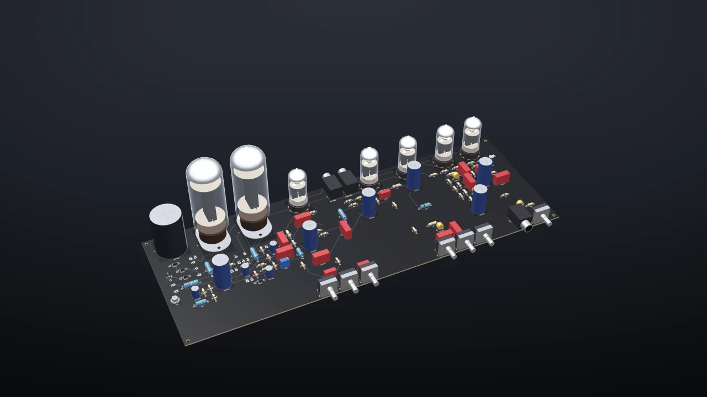
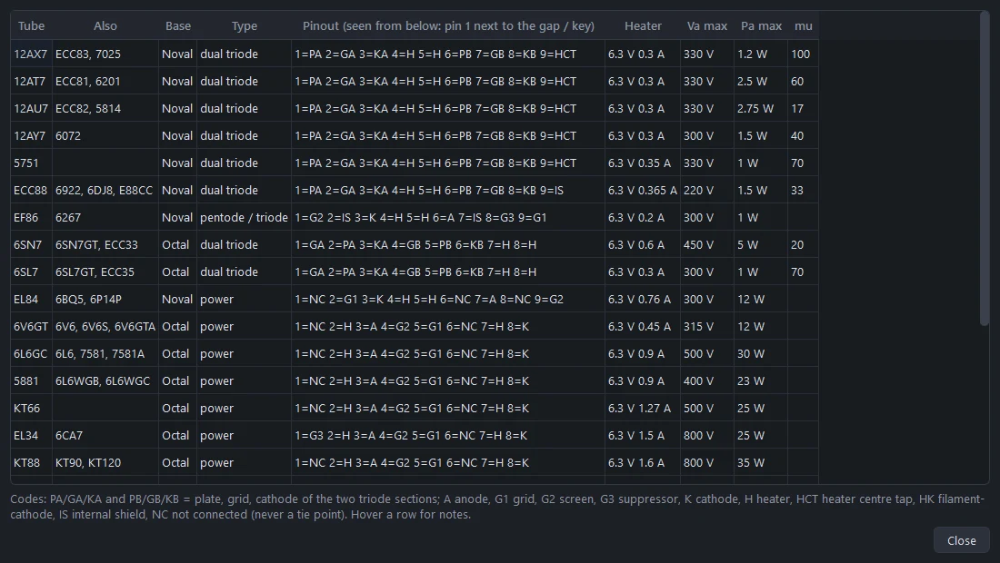
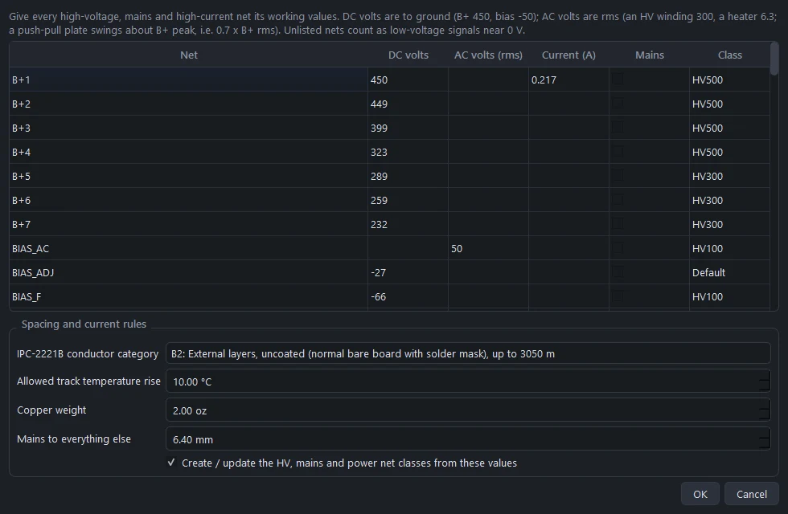
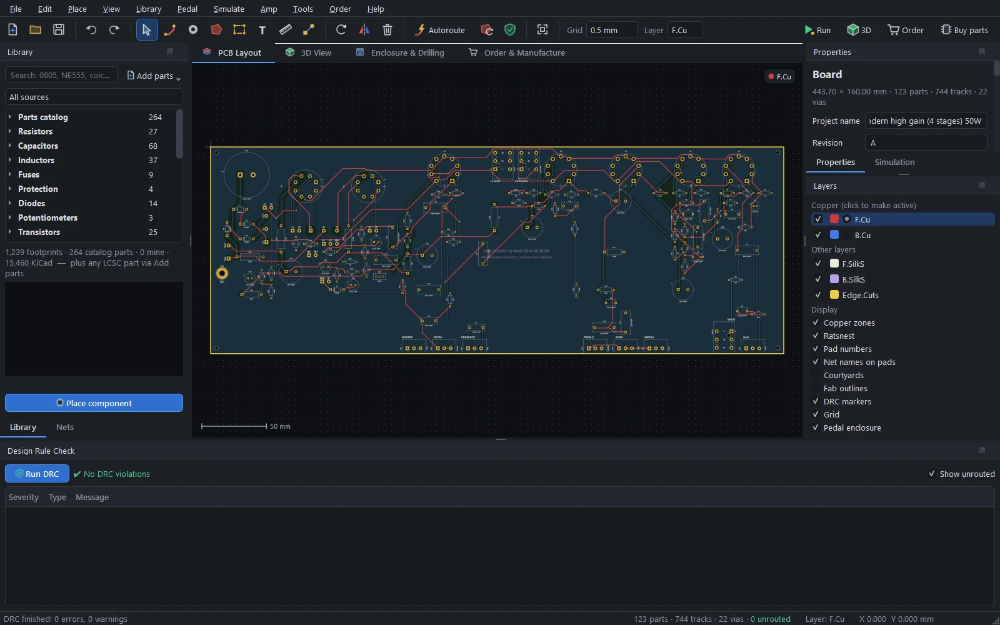
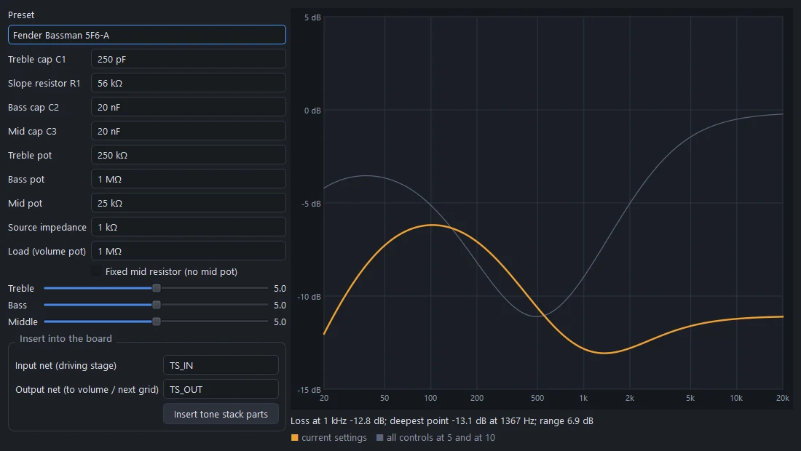

# Amp boards and high voltage

Guitar and bass amp boards: complete templates, tubes on sockets that show the tube in 3D, design rules that follow the voltage on every net, checks for the mistakes that hurt in an amp, a tone-stack designer and the calculators. The [Amp Designer](amp-designer.md) uses all of this to build an amp from a description; this guide is about the tools underneath, for when you design or edit an amp board yourself.

## Amp templates

**Amp › New amp from a template…** starts from a complete, placed board that autoroutes with a clean DRC. **Amp › Open example amp** opens the same boards already routed:

| Template | Circuit |
|---|---|
| **Tweed Champ 5 W** | Single-ended: 12AX7, 6V6GT, 5Y3GT rectifier |
| **EL84 18 W push-pull** | Two gain stages, a cathode follower into a Marshall-style tone stack, a cathodyne phase inverter, 2 × EL84 with cathode bias, EZ81 rectifier |
| **LM3886 bass amp 50 W** | TL072 preamp with a Bassman-style tone stack and a ×11 recovery stage, an impedance-balanced XLR DI, an LM3886 on ±30 V rails, speakON output |
| **LM3886 guitar amp 50 W** | A diode-clipping drive stage and a Marshall-style tone stack into an LM3886 |
| **Plexi crunch 50 W** | Made with the Amp Designer: 2 × EL34, master volume |
| **Modern high gain 50 W** | Made with the Amp Designer: 4 stages, 2 × 6L6GC, effects loop, depth |
| **Extreme high gain 100 W** | Made with the Amp Designer: 5 stages, 4 × 6L6GC, DC heaters |

On every board:

- the tubes stand in a row along the rear edge;
- the pots and jacks sit on the front edge, with their shafts through the chassis panel;
- each stage is packed between its tube and its controls;
- the power supply is at the far end from the input;
- transformer, speaker and heater leads land on labelled wire pads (`HV1/CT/HV2`, `AC1/CT/AC2`, `BIAS/0V`, `P1/B+/P2`, `SPK/COM`, `CHK1/CHK2`);
- a ground pour on the bottom layer keeps clear of high-voltage copper.

## Tubes on sockets

Value a tube socket with the tube type, "12AX7", "EL84" or "6L6GC", and:

- the 3D view draws that tube standing in the socket: see-through glass over the plates, the mica spacers, the getter flash, and glowing heaters;
- the BOM lists the tube;
- the amp checks know its pinout, heater current and ratings;
- the simulator plays it (see [Running the board](simulation.md#vacuum-tubes)).

24 tubes are included:

| Kind | Tubes |
|---|---|
| Preamp triodes | 12AX7 (ECC83, 7025), 12AT7, 12AU7, 12AY7, 5751, ECC88, 6SN7, 6SL7, 6C4 |
| Preamp pentode | EF86 |
| Power tubes | EL84, 6V6GT, 6L6GC, 5881, KT66, EL34, KT88, 6550, 6AQ5 |
| Rectifiers | 5Y3GT, 5AR4, 5U4GB, EZ81, 6X4 |

**Amp › Tube pinouts and ratings…** lists each one: the equivalents, the base (noval, octal, B7G), the pinout, the heater voltage and current, the maximum plate voltage and dissipation, and the amplification factor.

Ratings are design-centre maximums from the manufacturers' data. Guitar amps often run some tubes hotter, so the checks warn rather than fail.

### Sockets

| Socket | Pattern |
|---|---|
| Belton VT9-PT noval | PCB tails on a 21 mm circle, 1.8 mm holes |
| Belton VT8-PT octal | 17.2 mm circle, 1.6 mm holes |
| Straight-pin ceramic noval and B7G | |

Pin numbers run counter-clockwise from the gap (noval, B7G) or the key (octal), seen from the component side. The Belton patterns come from Belton's catalogue sheets (BVT9-1, BVT8-1): check them against your sockets.

## High-voltage design rules

**Amp › Net voltages and currents…** gives each net its DC volts, its AC volts (rms), its current and a mains flag. Boards from the templates and the Amp Designer come with these filled in.

From these:

- **Spacing follows IPC-2221B table 6-1**, by the peak voltage between two pieces of copper. Pads are component-lead terminations, so they use the lead column (A6); tracks and pours use the conductor column (B2), or B4 for an external conformal-coated board.
- **Net classes** carry the pad spacing, so a tube socket's own pin pitch is never "too tight". **Amp › Apply HV net classes** (or the checkbox in the dialog) creates them: HV100, HV300, HV500 and so on by voltage, *Mains* for mains nets, and *Power* for high-current nets.
- **The autorouter and the pour fill keep live nets apart pair by pair** (both ends of an HV winding, B+ next to a heater wire), not just from a single worst-case clearance, and route the highest-voltage nets first.
- **Placement** puts parts next to the pins they connect to: grid stoppers at the socket, decoupling caps at their stage.
- **Track widths** come from the IPC-2221 current formula for your copper weight and the temperature rise you allow (10 °C by default).
- **Mains to everything else** keeps 6.4 mm by default.

The IPC spacings are minimums for functional insulation. Mains wiring needs safety spacing to IEC 62368-1 or UL, which is why the mains clearance is conservative and why mains belongs on the chassis, not the board.

## Amp checks

Whenever a board has amp data, the design rule check (F8, or **Amp › Run DRC with HV checks**) adds:

- **HV spacing** from the actual voltage between two pieces of copper (lead or conductor column as above), plus the mains clearance from everything else.
- **Track width** against the net's current.
- **Capacitor ratings**: the voltage written in the value ("22uF 450V") against the net's voltage, and reversed electrolytics.
- **Resistor ratings**: power (V²/R) against the footprint's wattage, and the working voltage.
- **Bleeders**: every big high-voltage capacitor needs a resistive path to ground, so it discharges at switch-off.
- **Tube wiring**: unused or internally connected pins used as tie points, 6.3 V against 12.6 V heater wiring, shorted heaters, plate voltage above the tube's rating, and a tube on the wrong kind of socket.

**Amp › Heater & HV report** summarises the heater load per winding, the hot nets with their voltages and classes, and the amp checks.

## The tone stack designer

**Amp › Tone stack designer…** solves the classic treble-middle-bass stack as a complex network, with real pot tapers, as you move the knobs.

Presets: Fender Bassman 5F6-A, Fender Blackface (AB763 Twin), Fender Deluxe Reverb (6.8k fixed mid), Marshall JTM45 / 1959, Marshall JCM800 2203, Vox-voiced, a deep bass stack, and two high-gain stacks (a modern 47k slope, and a scooped US stack with a 47n mid cap), or your own values: the treble cap, slope resistor, bass and mid caps, the three pots, the source impedance (about 1k from a cathode follower, about 40k from a 12AX7 plate) and the load.

The plot shows your setting, and all controls at 5 and at 10, with the loss at 1 kHz, the deepest point and the range. **Insert tone stack parts** puts the stack on the board between the nets you name.

## Calculators

**Amp › Track width & HV spacing calculator…**:

- **Track width** for a current, at your temperature rise and copper weight, on an outer or inner layer (IPC-2221).
- **Conductor spacing** for a voltage, in each IPC-2221B category. For AC use the peak (rms × 1.41); between the two ends of an HV winding use twice the peak.

## Amp parts

All checked against KiCad's datasheet-based footprints where KiCad has them:

| Kind | Parts |
|---|---|
| Capacitors | Snap-in and axial HV electrolytics, axial film caps |
| Resistors | Cement resistors from 4 to 15 W |
| Rectifiers | KBU, GBU, DIP-4, KBPC and round bridges |
| Power-amp ICs | TO-3, LM3886, TDA7293 / TDA7294, LM1875 / TDA2050, TPA3116D2 (thermal pad on top) |
| Connectors | Neutrik XLR (female, male, combo), speakON, NRJ6HF 1/4" chassis jacks |
| Switching | Omron G5LE and G2RL relays |
| Controls | Alps 16 mm right-angle pots, Bourns 45 mm slide pots |
| Wiring | HV-spaced transformer, speaker and heater wire pads, an M4 star-ground point |

## Playing the amp

Amp boards can be simulated and played as a whole amp: the off-board transformer, speaker and supplies wired to the pads are modelled too. See [Running the board](simulation.md#amplifier-boards) and [Playing guitar through it](audio.md).

## Safety

Tube amps run at lethal voltages, and the filter capacitors keep them after the amp is switched off.

- The HV checks follow IPC-2221B and common practice, but they don't replace a safety standard (IEC 62368-1 / UL) for mains wiring.
- Keep the mains fuse, the switch and the transformer primary on the chassis, not on the board.
- Check that the bleeders discharge the caps, and measure before touching anything.
- Bring a new amp up on a dim-bulb tester, with the [first power-up checklist](amp-designer.md#build-help) from the spec sheet.
- If you haven't worked on high-voltage equipment before, learn from someone who has before you build one.
