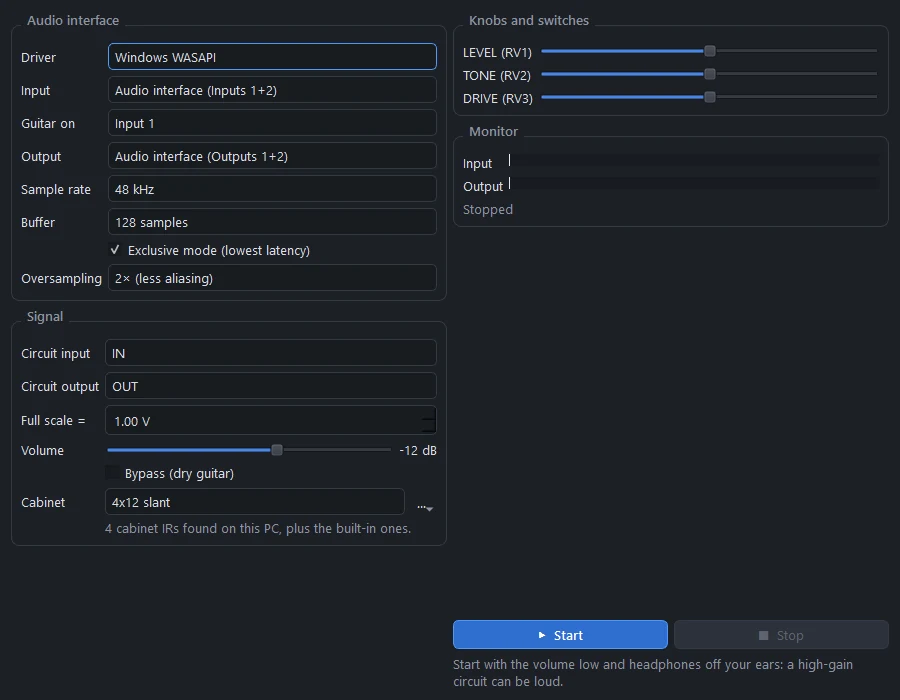
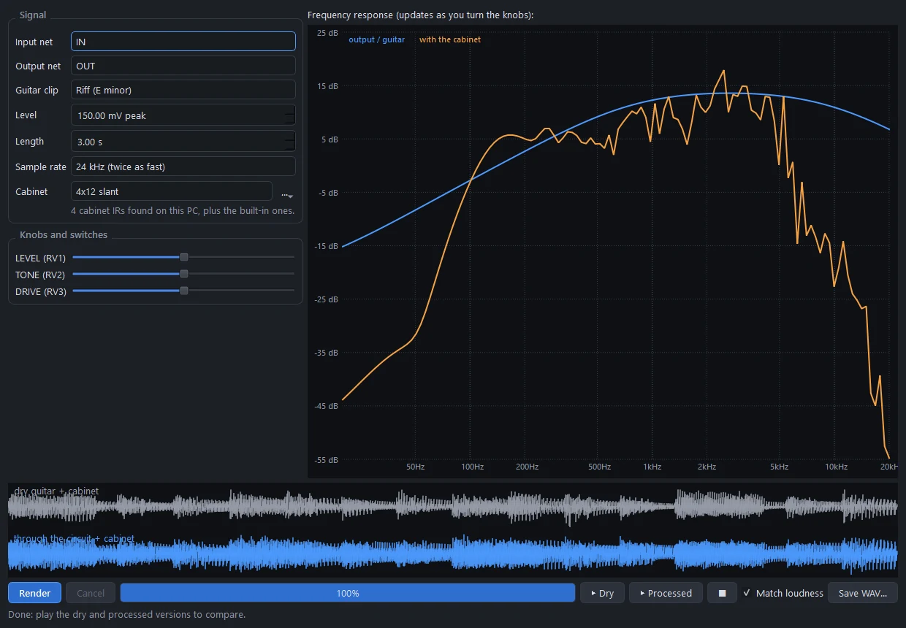
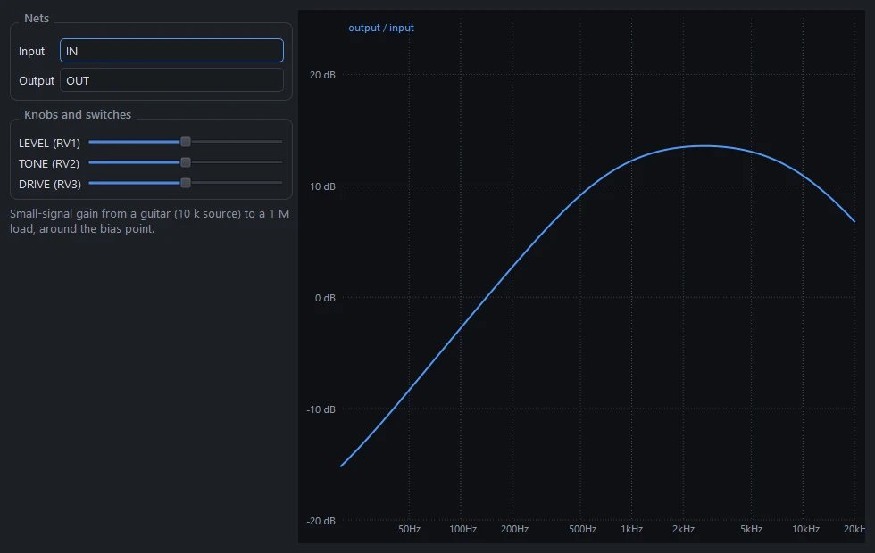

# Playing guitar through it

Pedal and amp boards can be played: your own guitar through the circuit in real time, a guitar clip rendered through it, or its frequency response as you turn the knobs. All of it is the board as you designed it, simulated part by part, with a speaker cabinet after it if you like.

## Play live

**Simulate › Play live (guitar in)…** (Ctrl+Shift+L), or **Play live…** in the Simulation panel. Plug your guitar into an audio interface, and the circuit runs between its input and your speakers or headphones, with about 10 ms of latency.

### Audio interface

| Setting | |
|---|---|
| Driver | WASAPI, ASIO, DirectSound or MME on Windows (Core Audio on macOS, ALSA or JACK on Linux). WASAPI is picked first. |
| Input, Guitar on | The interface and the channel your guitar is plugged into |
| Output | Where the sound goes. It plays on every output channel. |
| Sample rate | 44.1, 48, 88.2 or 96 kHz |
| Buffer | 32 to 512 samples. Smaller is lower latency; raise it if you hear crackles. |
| Exclusive mode | WASAPI exclusive mode, for the lowest latency |
| Oversampling | Off, 2× (less aliasing) or 4× |

### Signal

| Setting | |
|---|---|
| Circuit input, Circuit output | The nets the guitar goes into and the sound comes from (IN and OUT on pedals, the speaker on amps) |
| Full scale = | How many volts a full-scale input means. "1.00 V" means a 1 V guitar signal hits the interface's full scale. Set it so your interface's input gain gives a realistic guitar level. |
| Volume | The output level, -48 to +12 dB |
| Bypass | The dry guitar, for comparison |
| Cabinet | A speaker cabinet IR after the circuit (see [Speaker cabinets](#speaker-cabinets)) |

The pedal's or amp's own knobs are on the right: turn them while you play. The meters show the input and output levels.

Start with the volume low and headphones off your ears: a high-gain circuit can be loud.

### How it works

The board is compiled into a nodal DK state-space model, the component-modelling approach amp-sim plugins use. Every linear part (resistors, pots at their current setting, capacitors and inductors) is folded into constant matrices once; each sample, only the diodes, transistors, op-amps and tubes are solved, with a small Newton iteration, in a kernel compiled with numba. Oversampling runs the circuit at 2× or 4× the audio rate with anti-alias filters. The audio runs in its own process, so the window never interrupts it, and the chain is: input channel → volts → circuit → DC blocker → cabinet → volume → a soft safety limiter → output.

### What it costs

Pedals run comfortably on one CPU core. On an amp board, the output is the speaker, and full scale is twice the speaker voltage at rated power; a Plexi or EL84 amp needs roughly 20-60 % of one core at 2× oversampling. Before starting, PCBPro measures the cost and lowers the oversampling if needed. The largest high-gain designs (5 or 6 preamp tubes and four power tubes) can be too heavy to play live: Play live then says so, and **Audio play-through** still renders them.

## Audio play-through

**Simulate › Audio play-through…**, or **Play through…** in the Simulation panel, renders a guitar clip through the circuit, so you can compare the dry and processed sound and save it.

| Setting | |
|---|---|
| Input net, Output net | Where the guitar goes in and the sound comes out |
| Guitar clip | Riff (E minor), Metal riff (palm mutes), Open chords, Single notes, Power chords, a 440 Hz sine, or your own WAV file |
| Level | The guitar's peak level (150 mV is a typical single coil) |
| Length | 0.5 to 10 seconds |
| Sample rate | 48 kHz, or 24 kHz to render twice as fast |
| Cabinet | Off, or a cabinet IR |
| Knobs and switches | Every pot and switch on the board |

**Render**, then **▶ Dry** and **▶ Processed**. *Match loudness* plays both at the same level, so you hear the tone and not just the volume. **Save WAV…** keeps the result. The waveforms of both are drawn under the plot.

The guitar is a voltage source with a pickup-like 10 kΩ source impedance, and the output is loaded with 1 MΩ, like an amp input. The clips are synthesised the way a string and pickup make the sound (each string's modes, pluck and pickup positions, palm muting, the pickup's resonance), so they have the spectral balance of a real DI'd guitar.

Rendering uses the same compiled model as Play live, at 2× oversampling, in a background process.

## Frequency response

**Simulate › Frequency response…** plots the small-signal gain from the input to the output, from 20 Hz to 20 kHz, and updates live as you turn the knobs. The guitar's 10 kΩ source impedance and a 1 MΩ load are included. Audio play-through shows the same plot, with a second curve "with the cabinet" when one is selected.

## Speaker cabinets

An amp or pedal straight into a mixer sounds harsh, because a guitar speaker and its cabinet cut everything above about 5 kHz and shape the rest. All three audio tools can put a cabinet impulse response (IR) after the circuit.

- **Built-in.** Four public-domain cabinets: 1x12 open-back, 2x12 closed, 4x12 slant and 4x12 straight. They come from the "650 Assorted Cabinet Impulses" pack by zoyd on musical-artifacts.com, released into the public domain.
- **Your own IRs.** The first time a cabinet list opens, PCBPro searches this PC (Documents, Downloads, Music, Desktop, ProgramData) for cabinet IRs and lists them by folder: iZotope, MeldaProduction, Kilohearts, Serum and any IR packs you've downloaded. Use **…** to add a file or to search again.
- **Formats.** WAV (16, 24 or 32-bit, or float) and FLAC, mono or stereo, at any sample rate. (FLAC is decoded by PCBPro's own small decoder, with every frame's checksum checked.)
- **Processing.** Each IR is mixed to mono, resampled, trimmed to 0.5 s and level-matched over the guitar band, so switching cabinets keeps the loudness.
- **No added latency.** Live, the cabinet uses partitioned FFT convolution at the audio buffer size, so it adds no delay. Switching cabinets crossfades over one buffer.
- **Fair comparisons.** The cabinet also applies to the dry or bypassed sound.

## The Amp Designer's Listen tab

The [Amp Designer](amp-designer.md#listen) has its own Listen tab, which renders the amp it would build (before you build it) with a modelled metal riff or your own DI recording, and holds a render as "A" to compare with the next one.

## Hear some

The [website](https://gjnail.github.io/pcbpro/#listen) has clips rendered by PCBPro: the Amp Designer's voicings, the tightness settings, and the bundled pedals in front of amps.
