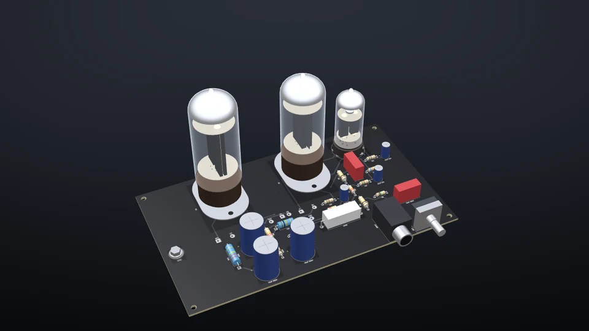
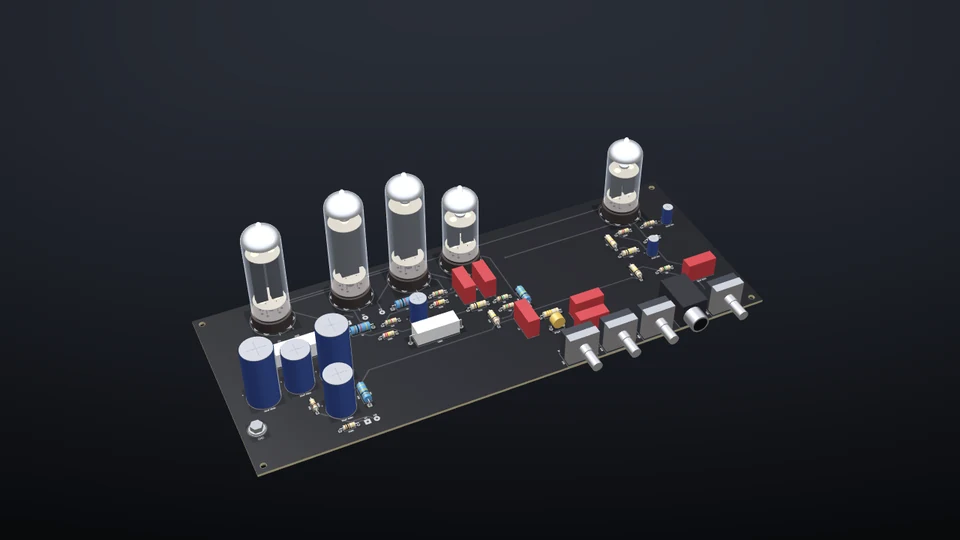
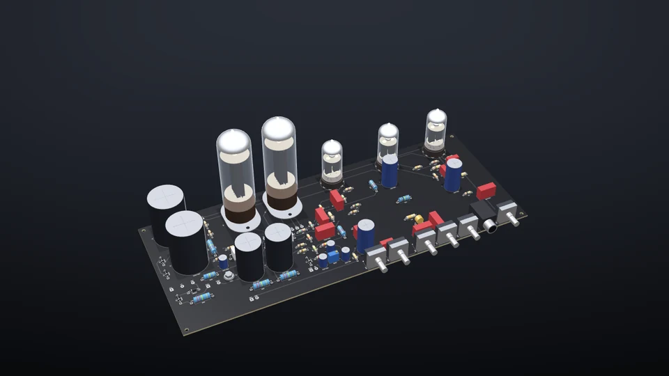
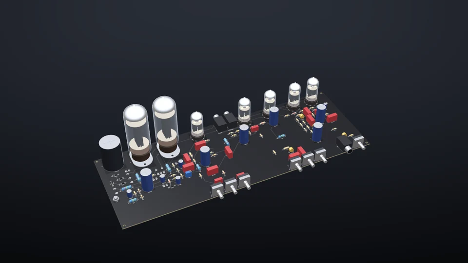
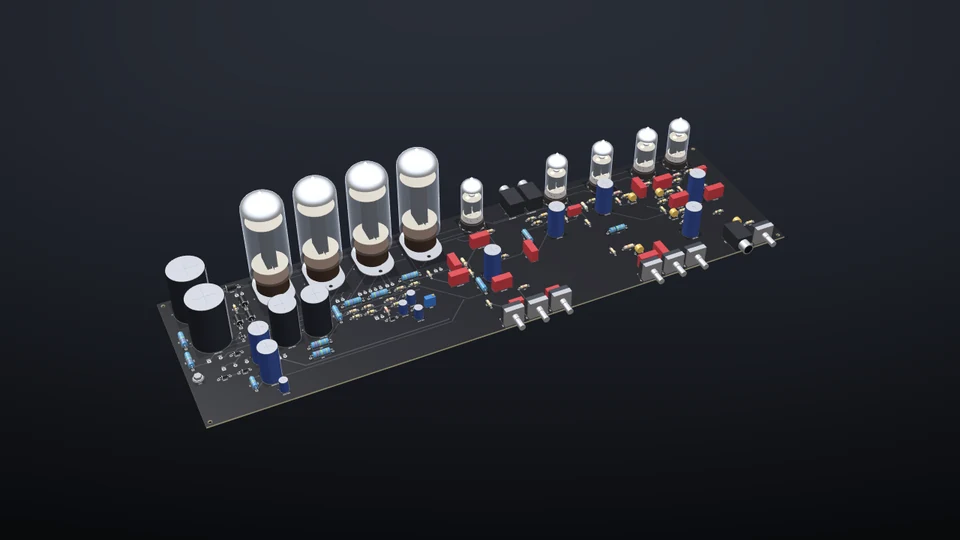
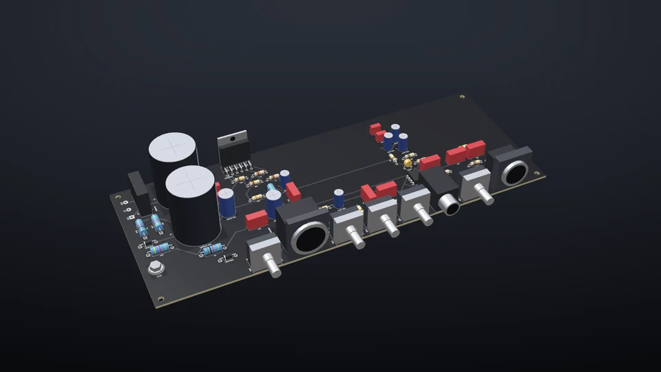
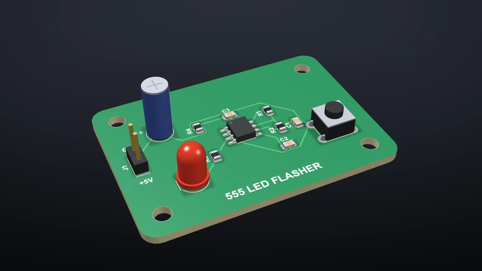

# Examples

PCBPro comes with 11 example projects, every one placed, routed and passing its design rule check. Open one, change anything, and save it as your own. Each can be simulated, and the pedals and amps can be played through. On the website the gallery is at <https://gjnail.github.io/pcbpro/examples.html>.

## Pedals

| | Example | Notes |
|---|---|---|
|  | **Three-knob overdrive** Hammond 125B, orange · 26 parts *Pedal › Open example: three-knob overdrive* | A TL072 op-amp overdrive with soft diode clipping, a treble-cut tone control and a volume, on a single 9 V supply with a 4.5 V bias. The board the tutorial builds. |
|  | **Tight Boost** Hammond 125B, green · 30 parts *Amp › Metal pedals › Tight Boost* | An input buffer, a TIGHT low cut from 30 to 340 Hz and a Tube Screamer style stage with its 720 Hz mid hump. Drive down, level up, in front of a high-gain amp. |
|  | **Noise Gate (4-cable)** Hammond 1590BB2, black · 39 parts *Amp › Metal pedals › Noise Gate (4-cable)* | Keyed from the guitar, gating the amp's effects loop: a precision envelope detector, a comparator with hysteresis and a J201 shunt gate that opens in under 1 ms. Works as a 2-jack gate too. |
|  | **High-Gain Distortion** Hammond 1590BB2, red · 43 parts *Amp › Metal pedals › High-Gain Distortion* | Two cascaded hard-clipping op-amp stages with a tight low-end pre-emphasis, an amp-style bass, middle and treble stack, and a recovery stage. |

## Amps

| | Example | Notes |
|---|---|---|
|  | **Tweed Champ 5 W** 12AX7 · 6V6GT · 5Y3GT · 38 parts *Amp › Open example amp › Tweed Champ 5 W single-ended* | The simplest tube amp there is: two gain stages into a single-ended 6V6 with cathode bias and a tube rectifier. Breaks up early and sweetly. |
|  | **EL84 18 W push-pull** 2 × 12AX7 · 2 × EL84 · EZ81 · 58 parts *Amp › Open example amp › EL84 18 W push-pull* | Two gain stages and a DC-coupled cathode follower into a Marshall-style tone stack, a cathodyne phase inverter and a cathode-biased EL84 pair. |
|  | **Plexi crunch 50 W** 3 × 12AX7 · 2 × EL34 · 94 parts *Amp › Open example amp › Plexi crunch 50 W* | Made with the Amp Designer: bright, punchy British crunch with a cathode follower, the Marshall tone stack, presence, a master volume and a fixed-bias EL34 pair. |
|  | **Modern high gain 50 W** 5 × 12AX7 · 2 × 6L6GC · 123 parts *Amp › Open example amp › Modern high gain 50 W* | Made with the Amp Designer: a four-stage preamp with a cold clipper, a post-distortion tone stack, depth and presence, and a tube-buffered effects loop. |
|  | **Extreme high gain 100 W** 5 × 12AX7 · 4 × 6L6GC · 149 parts *Amp › Open example amp › Extreme high gain 100 W* | Made with the Amp Designer: five cascaded stages, a deeply scooped EQ with a 10k middle control, a tight low end, DC heaters and four 6L6GCs. |
|  | **LM3886 bass amp 50 W** TL072 · LM3886 · 63 parts *Amp › Open example amp › LM3886 bass amp 50 W* | A solid-state bass amp: a TL072 preamp with a Bassman-style tone stack and recovery stage, an impedance-balanced XLR DI, and an LM3886 on ±30 V rails into speakON. |

## Boards

| | Example | Notes |
|---|---|---|
|  | **555 LED flasher** 50 × 35 mm · 16 parts *File › Open example: 555 LED flasher* | An NE555 astable flashing a red LED at about 1.5 Hz, with a reset button. Press F5 and it blinks; double-click a net to watch it on the oscilloscope. |

The project files are in [`pcbpro/resources/examples`](../pcbpro/resources/examples/). `tools/build_examples.py` rebuilds them from their generators.
