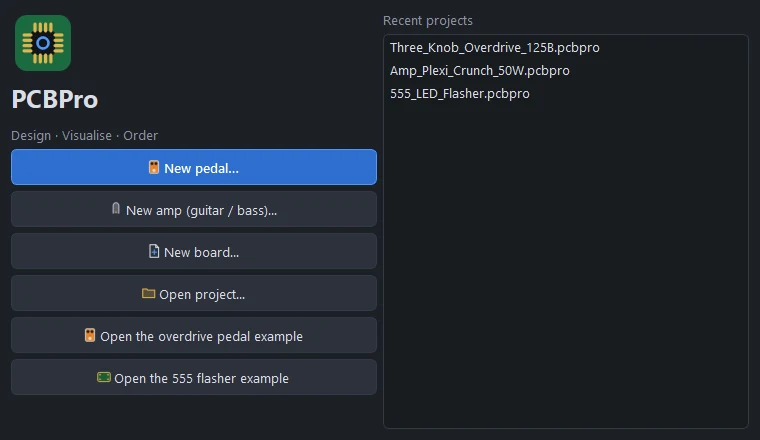
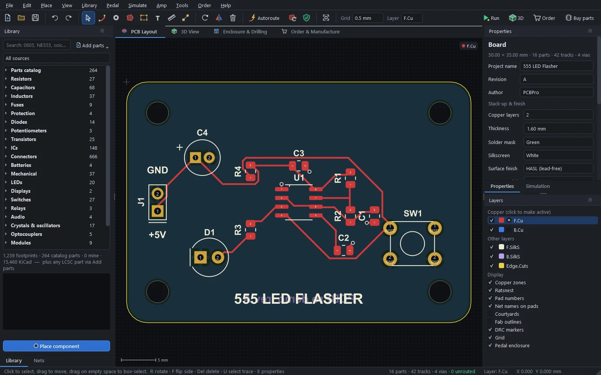

# Install and first steps

Install PCBPro, find your way around the window, and take a board from an empty project to a file you can order. The [tutorial](tutorial.md) then builds a whole guitar pedal, from the enclosure to the order.

## Requirements

- Windows 10 or 11, 64-bit. The Windows download needs nothing else.
- A graphics card with OpenGL 3.3, for the 3D view. Every card and integrated GPU from the last ten years has it.
- To run from source: Python 3.10 or newer. macOS and Linux run from source too, but haven't been tested as much (see [limits](troubleshooting.md#limits)).
- For **Play live**: an audio interface with a guitar input. Everything else in PCBPro works without one.

## Install

### The Windows download

1. Download `PCBPro-<version>-windows-x64.zip` from the [latest release](https://github.com/gjnail/pcbpro/releases/latest).
2. Unzip it anywhere, for example into `Documents` or `C:\Tools`. The `PCBPro` folder is self-contained: you can move it or copy it to a USB stick.
3. Double-click `PCBPro.exe`.

The download isn't code-signed yet, so Windows may show "Windows protected your PC" the first time. Click **More info**, then **Run anyway**. Each release lists the SHA-256 checksum of the zip, and `gh attestation verify PCBPro-<version>-windows-x64.zip --repo gjnail/pcbpro` checks that it was built from this repository by GitHub Actions.

To uninstall, delete the folder. PCBPro keeps your own parts and downloads in `Documents\PCBPro` and its settings in the registry under `HKEY_CURRENT_USER\Software\PCBPro`; delete those too if you want nothing left behind.

### From source

Get the source, either with Git:

```bash
git clone https://github.com/gjnail/pcbpro.git
cd pcbpro
```

or as a ZIP (on GitHub: **Code › Download ZIP**), unpacked anywhere. Then start it:

- **Windows:** double-click `PCBPro.bat`.
- **macOS and Linux:** run `./pcbpro.sh`.

The first run creates a private Python environment in `.venv` and installs the dependencies into it (close to 1 GB, a few minutes). After that it starts straight away.

Or set it up yourself:

```bash
python -m venv .venv
.venv/bin/pip install -r requirements.txt   # Windows: .venv\Scripts\pip ...
.venv/bin/python -m pcbpro
```

On Linux, Play live needs PortAudio (`sudo apt install libportaudio2` on Debian and Ubuntu).

**Building the Windows app yourself.** `powershell -ExecutionPolicy Bypass -File build_exe.ps1` builds `dist\PCBPro\PCBPro.exe` with PyInstaller. `dist\PCBPro\PCBPro.exe --selftest OUTDIR` then checks the build: see [Command line](shortcuts.md#command-line).

## The start screen



PCBPro opens on a start screen:

- **New pedal…** runs the [new-pedal wizard](pedals.md#the-new-pedal-wizard): pick a Hammond enclosure and your knobs, and get a board shaped for the box.
- **New amp (guitar / bass)…** opens the [Amp Designer](amp-designer.md): describe the amp you want and get the whole circuit, the numbers and a routed board.
- **New board…** starts an empty board of the size you choose.
- **Open project…**, the two examples (a three-knob overdrive and a 555 LED flasher), and your recent projects.

More examples, including six amps and three metal pedals, are under **Pedal › Open example**, **Amp › Open example amp** and **Amp › Metal pedals**. The [examples page](examples.md) shows them all.

## The window



- **Toolbar.** New, open and save, undo and redo, the editing tools, **Autoroute**, refill zones, **DRC**, fit, the grid and the active copper layer. On the right: **Run** (the simulation), **3D**, **Order** and **Buy parts**.
- **Tabs.** *PCB Layout* is the editor. *3D View* is the real-time 3D board. *Enclosure & Drilling* is for pedals: the drill template for the box. *Order & Manufacture* checks the board against each fab and exports the files.
- **Library** (left). One search box over every part: the 1,200+ built-in footprints, about 265 catalogue parts by manufacturer part number, your own parts, and the 15,000+ footprints of the KiCad library once you've downloaded it. The **Nets** tab next to it lists every net.
- **Properties** (right). The selected part, track, via, zone or text, or the board when nothing is selected. The **Simulation** tab next to it controls a running simulation.
- **Layers** (right). Which copper layer is active, which layers show, and display options: zones, ratsnest, pad numbers, net names on pads, courtyards, DRC markers, the grid and the pedal enclosure.
- **Status bar.** What the current tool does, the part and track counts, how many connections are still unrouted, the active layer and the cursor position in mm.

Every panel is a dock: drag it by its title to move it, or bring back a closed one from **View**.

### Moving around

| Do this | To |
|---|---|
| Wheel | Zoom at the cursor |
| Middle-drag, right-drag or Space + drag | Pan |
| Home | Fit the board in the window |
| L, Page Up, Page Down | Change the active copper layer |
| F3 | Switch to the 3D view and back |

## A board in six steps

1. **Start a board.** **File › New board…** (Ctrl+N): a name, a size preset or your own width and height, the corner radius, 2 or 4 copper layers and the thickness. You can change all of it later with **Tools › Board size…**, or draw any outline with the **Board outline** tool (B).
2. **Place parts.** Search the Library ("NE555", "0805", "usb c", "jst ph 4"), pick one and click **Place component** or press **P**, then click on the board. **R** rotates, **F** flips the part to the other side.
3. **Connect them.** PCBPro works from the board: there is no separate schematic. Use the **Connect** tool (**N**) to click a pad and then another to put them on one net, or type a net name into a pad's field in Properties. Thin lines (the *ratsnest*) show the connections still to route.
4. **Route.** Press **X** and click from pad to pad for 45° tracks (**V** drops a via and changes layer, **W** changes the width, **/** the corner posture), or let **Autoroute** (Ctrl+Shift+A) do it.

   

5. **Check it.** **Tools › Run DRC** (F8) lists clearance problems, shorts, thin tracks, small drills and annular rings, copper too close to the edge, overlapping courtyards and unrouted connections. Click one to zoom to it. Press **F3** to look at the board in 3D, and **F5** to [run the circuit](simulation.md).
6. **Order it.** The **Order & Manufacture** tab compares JLCPCB, PCBWay, OSH Park and AISLER, checks your board against each one, exports Gerbers, drill files, BOM and pick-and-place, and opens the fab's upload page. **Buy parts** makes the shopping list. See [Manufacturing and ordering](manufacturing.md) and [Buying components](buying-parts.md).

Save with Ctrl+S. Projects are `.pcbpro` files (JSON), one file per board.

## Where things are kept

| What | Where |
|---|---|
| Your projects | Wherever you save them. The default folder is `Documents\PCBPro`. |
| Exports (Gerbers, drills, BOM, CPL, drill template) | A `<project>_fab` folder next to the project, unless you choose another. |
| My library (imported and wizard parts) | `Documents\PCBPro\library`, one JSON file per part. You can share them. |
| The LCSC download cache | `Documents\PCBPro\library\.cache\lcsc` |
| The KiCad library, if downloaded | `Documents\PCBPro\kicad-footprints` |
| Settings (window layout, recent files, audio devices, cabinets) | Windows registry, `HKEY_CURRENT_USER\Software\PCBPro` |

## Where next

- [Tutorial: your first pedal](tutorial.md): a pedal from the enclosure to the order, in about 45 minutes.
- [The layout editor](layout.md): every tool, routing, pours, net classes and the design rule check.
- [Guitar pedals](pedals.md), [the Amp Designer](amp-designer.md) and [high-gain amps and pedals](high-gain.md).
- [Running the board](simulation.md) and [playing guitar through it](audio.md).
