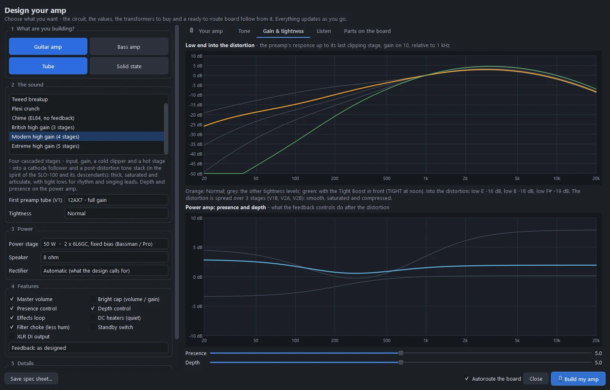
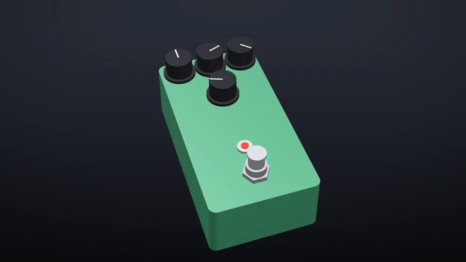
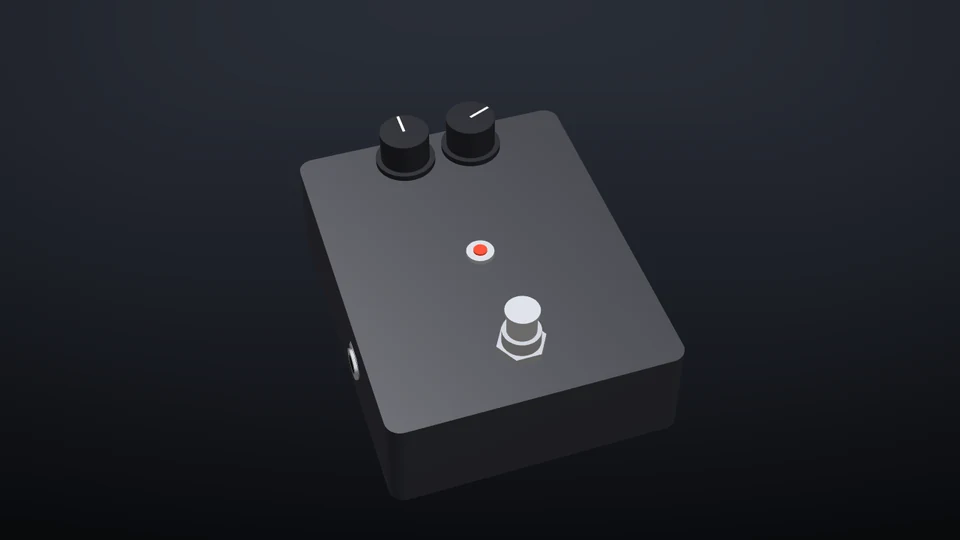
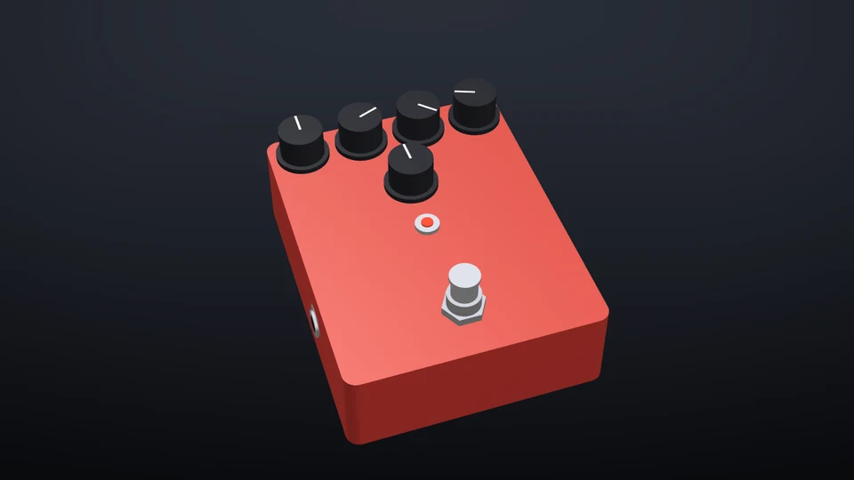

# High-gain amps and metal pedals

Three cascaded-preamp voicings in the Amp Designer, the controls that matter for metal (tightness, depth, a tube-buffered effects loop, DC heaters), an analysis of where each stage distorts, and three pedals built to go with them: a Tight Boost, a 4-cable Noise Gate and a High-Gain Distortion. Every one of them can be heard in the simulator before you build it.

## The three voicings

| Voicing | Stages | In the spirit of | Default power stage |
|---|---|---|---|
| **British high gain** | 3 | JCM800 2203: the classic hard-rock and thrash sound, mid-forward and aggressive | 50 W, 2 × EL34, fixed bias |
| **Modern high gain** | 4 (input, gain, a cold clipper and a hot stage) | SLO-100 and its descendants: thick, saturated and articulate, with tight lows for rhythm and singing leads | 50 W, 2 × 6L6GC, fixed bias |
| **Extreme high gain** | 5 | 5150 / Rectifier territory: the most saturation, a deeply scooped post-distortion EQ (a 10k middle control, like the big American amps) and a very tight low end for fast palm mutes and down-tuned and extended-range guitars | 100 W, 4 × 6L6GC, fixed bias |

What they share:

- Every stage after the gain control has a 1M grid leak and a 470k / 470p stopper, the treble-peaking attenuator high-gain amps use between stages.
- A 10k cold-clipper stage: biased near cut-off so it clips one half-wave hard, the asymmetric clipping these amps are known for.
- A DC-coupled cathode follower drives a tone stack *after* the distortion.
- A master volume, a stiff solid-state rectifier and fixed bias by default.
- In the 4- and 5-stage preamps, the late stages run unbypassed behind 470k dividers (see [Gain structure, checked in the simulation](#gain-structure-checked-in-the-simulation)).

Pick one in the [Amp Designer](amp-designer.md) (Ctrl+Alt+A). Two are built and ready to open: **Amp › Open example amp › Modern high gain 50 W** and **Extreme high gain 100 W**.

## Tightness

How much bass reaches the distortion decides whether palm mutes chug or turn to mush. The **Tightness** setting picks the cathode-bypass and coupling capacitors through the whole cascade:

| Tightness | For |
|---|---|
| **Fat** | Full low end: doom, stoner, slow and heavy |
| **Normal** | The voicing as designed |
| **Tight** | Palm-mute focus: thrash and modern metal |
| **Djent** | Extended-range guitars, very tight: the bass is cut before the distortion and put back after it |

The spec sheet shows how far the low E of a 6-string (82 Hz), the low B of a 7-string (62 Hz) and the F# of an 8-string (46 Hz) arrive below the mids at the last clipping stage.

## Depth

**Depth** (a resonance control) sits next to presence on the feedback loop. It gives up to about +6 dB at 80 Hz in the power amp, so the low end thumps without loosening the preamp: the tightness keeps the distortion clean of mud, and the depth puts the weight back after it.

## The effects loop

A tube-buffered series loop, for a noise gate and time effects:

- a cathode follower sends at pedal level (about -7 dBV),
- the RETURN jack's switch normals the signal back with nothing plugged in,
- a recovery stage restores the level.

The SEND and RETURN jacks stand on the rear edge of the board, by the tubes.

## DC heaters

The preamp tubes' heaters on DC: a Schottky bridge with a CRC filter, riding on the heater elevation. There's no heater hum in the gain stages, which matters when the first stage's hum is amplified by four more.

## Where it distorts

From each stage's operating point, the designer works out where the amp distorts:

- every stage's drive relative to its clipping point, cut-off or grid current, with the gain on 10 and at noon;
- where on the GAIN knob the amp starts to distort;
- the hiss: how far below the clipping point it sits, and below the playing level.

The analysis follows the positive and negative half-waves separately, so a cold clipper (which cuts off on one half-wave) and a hot stage (which runs into grid current on the other) are told apart. It includes the cathode-bypass shelves, the coupling-cap high-passes, the 470k / 470p attenuators and each stage's Miller capacitance against the impedance that drives it.

## The Gain and tightness tab



- **Low end into the distortion**: the preamp's response up to its last clipping stage, gain on 10, relative to 1 kHz. This design's tightness is drawn in colour and the other levels in grey, together with the effect of the Tight Boost pedal in front.
- **Power amp: presence and depth**: what the feedback controls do after the distortion, with sliders for both.

## Listening

The [Listen tab](amp-designer.md#listen) plays the design with a modelled metal riff: palm-muted chugs on the low E, open power chords that ring, and a short line. The riff is built the way a real string and pickup make the sound (modal synthesis with the pluck and pickup positions, palm muting that damps the high modes most, the pickup's resonance), so it has the spectral balance of a real DI'd guitar, with most of its energy at 80-800 Hz. A white-noise pluck, by contrast, keeps its upper harmonics far too long and makes every high-gain amp sound like the same fizz.

Better still, load your own DI recording.

You can hear the three voicings, the tightness settings and the Tight Boost on the [website](https://gjnail.github.io/pcbpro/#listen).

## Gain structure, checked in the simulation

Played through the tube simulation, a stage driven far past clipping holds a decaying palm mute at full level, so its low end swells after the pick instead of dying away. That is why the 4- and 5-stage preamps run their late stages unbypassed behind 470k dividers: it keeps the rhythm sweet spot around noon on the GAIN knob.

The tests play the riff through every high-gain voicing and check that the chugs peak soon after the pick and die away with the mute, and that the simulated amp confirms the tightness analysis.

## Metal pedals

**Amp › Metal pedals**, or the links under *Pedals for this amp* on the spec sheet. Each one is a complete pedal: an enclosure, its drilling, a placed and routed board, and notes on wiring and use. The simulator can play through each of them.

| Tight Boost | Noise Gate (4-cable) | High-Gain Distortion |
|---|---|---|
|  |  |  |

### Tight Boost

A 125B with LEVEL, TONE, DRIVE and TIGHT. An input buffer, a TIGHT control (a variable low cut from 30 to 340 Hz on a reverse-log pot) and a Tube Screamer style op-amp stage with soft clipping and its 720 Hz mid hump.

Drive down and level up in front of a high-gain amp is the classic metal trick: the lows that would turn palm mutes to mush are cut before the preamp, the mids are pushed, and the attack gets sharper.

### Noise Gate (4-cable)

A 1590BB2 with THRESHOLD and RELEASE. It listens to the guitar and gates the amp's effects loop:

- IN goes through a buffer to SEND, which goes to the amp's input;
- the amp's effects-loop send comes back into RETURN, through the gate and out to OUT, into the loop return;
- a precision envelope detector on the guitar signal feeds a comparator with hysteresis, which drives a J201 shunt gate. It opens in under 1 ms and fades closed.

Because it gates after the preamp, it silences the preamp's hiss between riffs without choking notes. With nothing in RETURN, the jack's switch feeds the guitar back in and it works as an ordinary 2-jack gate.

### High-Gain Distortion

A 1590BB2 with LEVEL, GAIN, BASS, MID and TREBLE. Two cascaded op-amp gain stages, each hard-clipped by a silicon diode pair, with a tight-low pre-emphasis; an amp-style bass / middle / treble stack; and a recovery stage. Thick, tight metal distortion into a clean amp, or stacked into a crunch channel.

## A rig

The pieces fit together the way a metal rig does:

```
guitar → Tight Boost → Noise Gate IN ─→ SEND → amp input
                                          amp loop send → Noise Gate RETURN ─→ OUT → amp loop return
```

The amp's spec sheet lists the pedals that suit it, with a line on why, and its tips cover noise, the cabinet and biasing.

## Tips

- Set the gain lower than you think. Around noon on a 4- or 5-stage preamp is already saturated; more mostly adds hiss and compression.
- Tighten before you cut bass at the tone stack: bass cut after the distortion just makes a thin, mushy sound.
- Use a closed-back 4x12 IR to judge the low end. Open-back cabinets lose the thump.
- A noise gate in the loop rather than in front keeps the attack intact.
