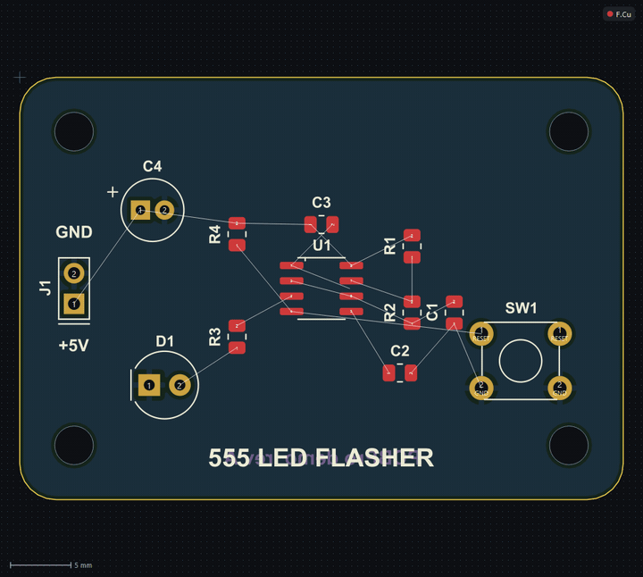
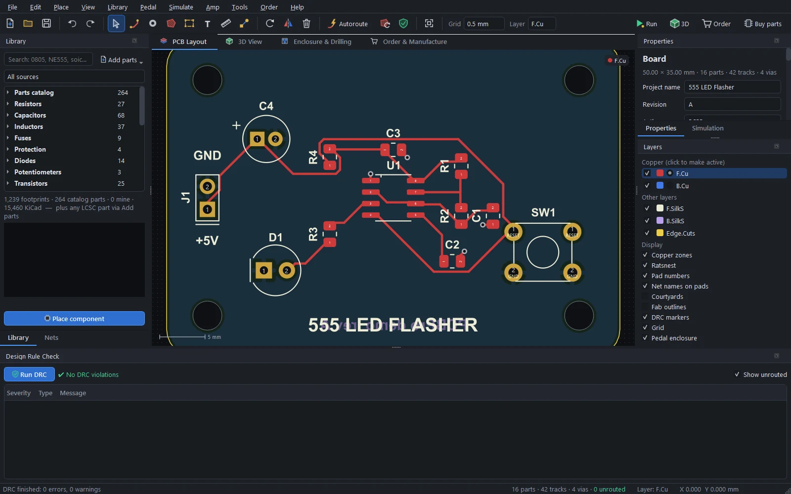

# The layout editor

Everything about drawing a board: the outline, placing parts, making the netlist, routing by hand and with the autorouter, copper pours, net classes and the design rule check.

PCBPro works from the board, without a separate schematic: you place footprints and give their pads nets, and the board *is* the netlist. That keeps simple boards (a pedal, an amp, a breakout) fast to make, and every other part of PCBPro (the simulator, the checks, the BOM) reads the same netlist.

## The board

**File › New board…** (Ctrl+N) asks for a name, a size (a preset or your own width and height), a corner radius, 2 or 4 copper layers and the thickness. **Tools › Board size…** changes them later.

For any other shape, use the **Board outline** tool (**B**): click the corners, and double-click or press Enter to close the shape. The outline goes on the `Edge.Cuts` layer. Cut-outs inside the board are drawn the same way.

With nothing selected, the **Properties** panel shows the board:

- its size, the part, track and via counts;
- the project name, revision and author;
- the stack-up and finish: copper layers, thickness, solder mask and silkscreen colours, the surface finish (lead-free HASL, HASL, ENIG or OSP) and the copper weight (1 or 2 oz). These go to the [order page](manufacturing.md) and colour the [3D view](3d-view.md);
- the design rules: the default track width, clearance, via diameter and drill, the minimum track and drill, the copper-to-edge clearance, the solder-mask expansion, and whether vias are tented.

Units are millimetres throughout. The grid (toolbar) goes from 0.05 mm to 1 mm, plus the 25, 50 and 100 mil grids that through-hole parts sit on.

## Tools

| Key | Tool | What it does |
|---|---|---|
| S or Esc | Select | Click to select, drag to move, drag on empty space to box-select. **U** selects the whole trace under the cursor. |
| X | Route | Draws tracks from pad to pad (see [Routing by hand](#routing-by-hand)). |
| V | Via | Places a via. While routing, adds a via and changes layer. |
| Z | Zone | Draws a copper pour (see [Copper pours](#copper-pours)). |
| B | Board outline | Draws the board's edge or a cut-out. |
| T | Text | Places text on the silkscreen or copper. |
| M | Measure | Click two points to measure the distance between them. |
| N | Connect | Click pads one after another to put them on one net. |
| P | Place | Places the part selected in the Library. |

With parts or tracks selected:

| Key | Action |
|---|---|
| R / Shift+R | Rotate by 90° (Shift: the other way) |
| F | Flip to the other side of the board |
| Del | Delete |
| Ctrl+D | Duplicate |
| Arrows | Nudge by one grid step (Shift: ten) |
| E or double-click | Open in Properties |

Moving a part drags its tracks along. Everything is undoable (Ctrl+Z, Ctrl+Y).

## Placing parts

Find the part in the **Library** panel (see [The parts library](library.md)), then click **Place component**, double-click it, or press **P**, and click on the board. The part follows the cursor until you click; **R** rotates it first.

Select a placed part to edit it in Properties:

- **Reference** (R1, U3...) and **Value** (10k, 100nF, TL072). The Value box offers the standard E24 resistor values and E6 capacitor and inductor values.
- **Position, rotation and side.** A part on the bottom is mirrored, as it would be seen through the board.
- **MPN and LCSC number.** These go into the BOM and decide what JLCPCB assembles. Catalogue parts and LCSC imports fill them in.
- **Show value.** Prints the value next to the part on the silkscreen, kit style. **Pedal › Silkscreen › Print part values on all parts** does it for every part.
- **Pad nets.** Every pad's net, as a box you can type into or pick from.
- **Simulation model.** What the simulator treats the part as (see [Running the board](simulation.md#part-models)).

## Making the netlist

A net is just a name shared by pads, tracks, vias and pours. There are three ways to make one:

1. **The Connect tool** (**N**). Click a pad, then another: both go on the same net, and the tool carries on from the second pad, so you can click your way along a whole net. If neither pad had a net, a new one is made; if both had different nets, PCBPro asks before merging them. Press Esc to start again from a new pad.
2. **Properties.** Type a net name into a pad's box. Typing an existing name joins that net; a new name makes a new net.
3. **The Nets panel.** Every net with its number of pads and of unrouted connections. **Add**, **Rename** (renames it everywhere), **Delete** (takes it off every pad, track and zone) and **Class…** (see [Net classes](#net-classes)). Selecting a net highlights it on the board.

Pads on the same net that aren't connected by copper yet are joined by thin lines, the *ratsnest*. The status bar counts them as **unrouted**.

## Routing by hand

Press **X**, click a pad, and move: the track follows the cursor with a 45° corner, snapping to the grid and to pads. Click to fix a corner and carry on.

| Key | While routing |
|---|---|
| Click | Fix the corner and continue |
| Double-click or Enter | Finish the track |
| Backspace | Remove the last corner |
| V | Add a via here and continue on the other layer |
| W / Shift+W | Make the track wider / narrower |
| / | Switch the corner between "45° first" and "straight first" |
| Esc | Cancel this track |

The track starts at the width of its net's class. While you route, copper that would come too close to another net's copper is highlighted, so you see a clearance problem before you make it. A track that ends on a pad of its net completes that connection and its ratsnest line disappears.

The active layer (toolbar, or **L**) is the layer new tracks go on. On a 4-layer board, **Page Up** and **Page Down** step through the inner layers too.

## The autorouter

**Tools › Autoroute…** (Ctrl+Shift+A) routes every unrouted connection.

| Option | Choices |
|---|---|
| Routing grid | Auto (from the default track width and clearance), or 0.1 to 0.5 mm. Finer grids find more routes and take longer. |
| Via usage | Normal, Avoid vias, or Prefer vias |
| Connect pour nets with stubs | On: nets that have a copper pour (usually GND) are routed last, with short stubs and vias into the pour. |

How it works: the board is rasterised into a clearance grid for each net (every other net's copper, grown by the clearance and half the track width, is an obstacle), and each connection is found with an A* search over 45° moves and vias. On two-layer boards it prefers horizontal tracks on one side and vertical on the other, which leaves room for the connections that come later. Connections are routed shortest first, except that power-pour nets wait until the end; on amp boards the highest-voltage nets go first, and spacing between nets follows their voltage (see [Amp boards](amps.md#high-voltage-design-rules)).

The autorouter works on a copy of the board, so **Cancel** leaves your design untouched, and one Ctrl+Z takes its result back out. If some connections can't be routed, PCBPro says which nets: move parts apart, try a finer grid, or route those by hand. Tracks you've already drawn are kept and routed around.

## Copper pours

A pour (zone) fills an area of a layer with copper on one net, usually GND, keeping clear of everything else.

Draw one with the **Zone** tool (**Z**): click the corners, double-click to close. Or use **Place › Add ground pour on active layer** to cover the whole board. The zone's settings:

| Setting | Meaning |
|---|---|
| Net | The net the copper belongs to |
| Layer | Which copper layer |
| Clearance | Gap to other nets' copper (at least the net classes' clearance) |
| Minimum width | Thinner slivers of copper are removed |
| Priority | Where zones overlap, the higher priority fills first |
| Thermal relief | Through-hole pads connect through four spokes instead of solidly, so they can be soldered |

Pours refill automatically after every edit. Islands that end up unconnected to their net are removed. **Tools › Refill zones** (Ctrl+B) refills by hand, and DRC warns if the pours are out of date.

## Net classes

A net class sets the track width, clearance, via diameter and via drill for a group of nets. Every net is in *Default* until you change it: select the net in the Nets panel and click **Class…**, then pick a class or type a new name (a new class starts with twice the default track width). The *Default* class is edited in the board's Properties.

The router, the autorouter, pours and DRC all use the class of each net. Amp boards get their classes from the nets' voltages and currents (**Amp › Apply HV net classes**).

## The design rule check

**Tools › Run DRC** (F8) checks:

- the board outline is closed and valid;
- **clearances** between copper of different nets, on every layer, and **shorts** (copper of two nets touching, including through pours);
- **track widths** against the minimum, **drills** of vias and pads against the minimum drill, and **annular rings** of vias and plated pads;
- copper too close to the **board edge**, **hole-to-hole** spacing, and parts outside the outline;
- **courtyard** overlaps between parts;
- **unrouted** connections (the DRC panel's *Show unrouted* switches these on and off);
- **pours** that need refilling.

Errors must be fixed before you order; warnings are worth a look. Click a row to zoom to it; the problem is marked on the board until the next run. Pedals add [enclosure checks](pedals.md#enclosure-checks) and amps add [high-voltage checks](amps.md#amp-checks) to the same list.

## Text and silkscreen

The **Text** tool (**T**) places text on any silkscreen or copper layer, at a size you choose. Text on a bottom layer is mirrored so it reads correctly from below. Part references are printed next to each part; untick *Show reference* for a part to hide it (mounting holes do by default).

The Layers panel switches the display of each layer and of the ratsnest, pad numbers, net names on pads, courtyards, fab outlines, DRC markers, the grid and the pedal enclosure. Click a copper layer to make it active.

## Files

Projects are `.pcbpro` files: JSON, with the board, parts (including their footprints, so a project opens anywhere, even without the library it came from), tracks, vias, zones, texts, net classes and rules, plus the pedal enclosure, the amp's settings and the simulation's sources and part overrides when there are any. **File › Open recent** lists the last ones you opened. To start from somebody else's footprint, see [The parts library](library.md).
