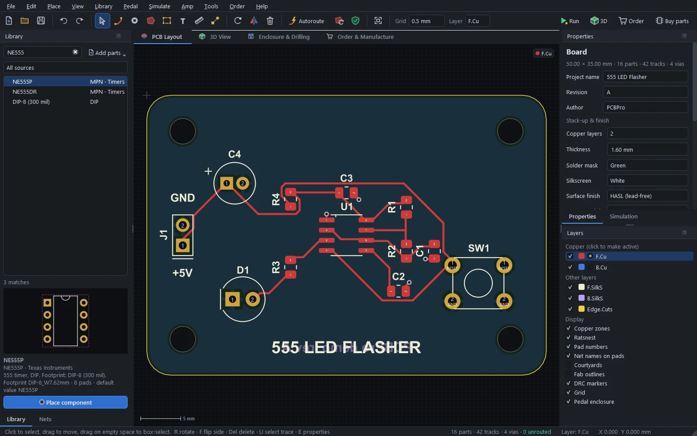
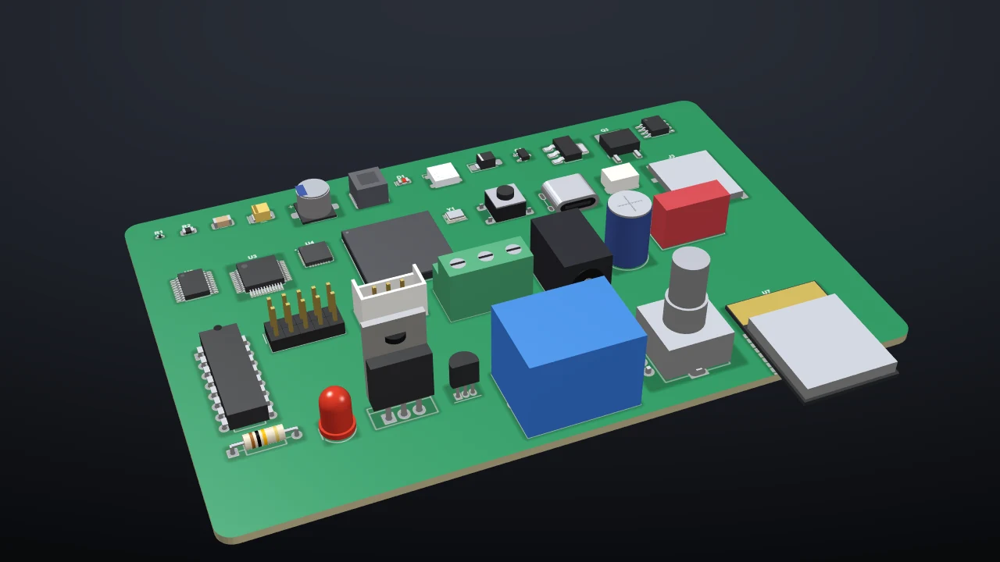
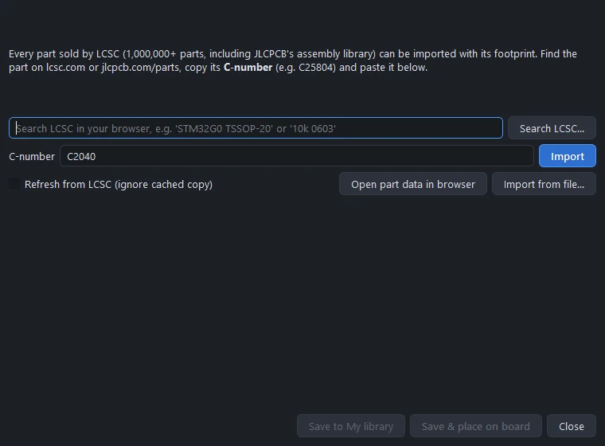
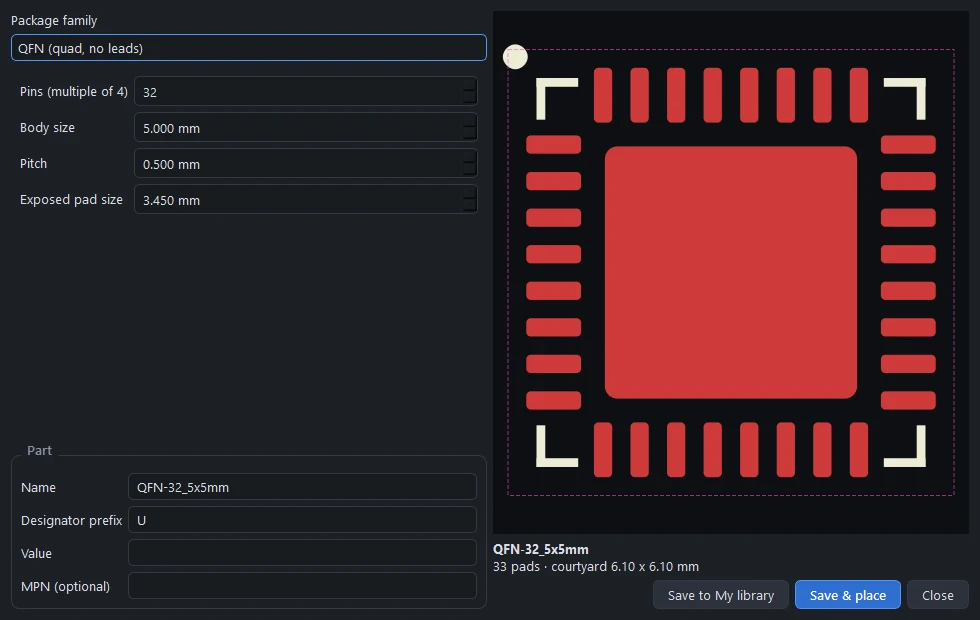
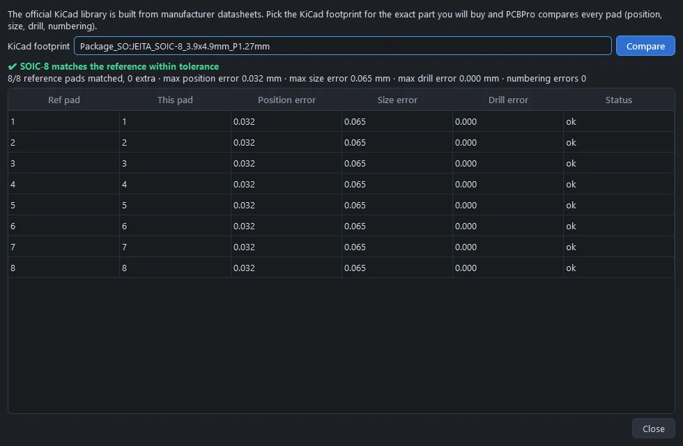

# The parts library

One search box over every part PCBPro knows: 1,200+ generated footprints, about 265 real parts by manufacturer part number, any of LCSC's million-plus parts by its C-number, the official KiCad library's 15,000+ footprints, and your own. Every footprint gets a 3D model, and footprints can be checked pad by pad against KiCad's datasheet-based library.

## Searching

Type in the Library panel's search box. Every word has to match, in any order, against the part's name, category, package, manufacturer part number and keywords:

| Search | Finds |
|---|---|
| `ne555` | The NE555P (DIP-8) and NE555DR (SOIC-8) from the catalogue |
| `0805` | 0805 resistors, capacitors, inductors, ferrite beads, fuses and LEDs |
| `soic 8` | SOIC-8 in every body width |
| `jst ph 4` | JST PH connectors with four pins, vertical and right-angle, through-hole and SMD |
| `usb c` | USB-C receptacles (16-pin and power-only) |
| `alpha 16` | The Alpha 16 mm pedal pots |
| `12ax7` | The noval tube socket valued as a 12AX7 |

The box under the search picks the source: everything, built-in footprints, the catalogue, My library, or KiCad. With no search, the tree lists the categories. Selecting a part shows its footprint, its pad count and courtyard, and its datasheet details. **Place component** (or **P**, or a double-click) puts it on the board.

## Built-in footprints

The 1,200+ built-in footprints are generated from their dimensions, so every size and pin count exists:

- **Passives.** Chip resistors, capacitors, inductors, ferrite beads and fuses from 01005 to 2512. Tantalum capacitors in cases A to V, SMD and radial electrolytics, film and disc capacitors, axial resistors from 1/8 W to 3 W, MELF parts and resistor arrays. Power inductors, toroids, PTC fuses, varistors, trimmers and pots.
- **Semiconductors.** SOD and SMA, SMB and SMC diodes, DO-35 to DO-201AD, SOT-23, -323, -523, -563, -89 and -223, DPAK, D2PAK, PowerPAK, TO-92, TO-126, TO-220, TO-247 and TO-5.
- **ICs.** Every common SOIC, SSOP, QSOP, TSSOP, HTSSOP, MSOP, VSSOP, QFP (32 to 208 pins), QFN, DFN, BGA (36 to 676 balls), PLCC, DIP and SIP variant.
- **Connectors (660+).** Pin headers and sockets at 2.54, 2.0 and 1.27 mm up to 40 pins, right-angle and IDC box headers. JST PH, XH, EH, VH, ZH, SH and GH; Molex KK, PicoBlade, Micro-Fit and Mini-Fit. Screw terminals from 2.54 to 10.16 mm. USB-C, Micro-B, Mini-B, USB-A and USB-B. Barrel jacks, RJ45, SMA, U.FL, 3.5 mm audio jacks, microSD and SIM sockets, D-Sub, FFC/FPC and battery holders.
- **Other.** LEDs, including WS2812B and SK6812 and 7-segment displays. Tactile, slide, toggle and DIP switches and EC11 encoders. Relays, buzzers, crystals and oscillators, optocouplers. Modules: ESP32-WROOM, ESP-12F, Arduino Nano, Pro Mini and Pro Micro, Raspberry Pi Pico, NRF24L01, OLED displays. Mounting holes, test points, fiducials, solder jumpers and wire pads.
- **Pedal parts.** Alpha 16 mm pots (single and dual gang) and 9 mm pots, the PCB-mount 3PDT footswitch, DPDT and 3PDT mini toggles, the Neutrik NMJ6HCD2 1/4" jack, a 2.1 mm DC jack, TO-92 transistors and JFETs in every pin order on a wide 2.54 mm grid, and labelled wire-pad strips. See [Guitar pedals](pedals.md#pedal-parts).
- **Amp parts.** Tube sockets that draw their tube in 3D, HV electrolytics and film caps, cement resistors, bridge rectifiers, power-amp ICs, XLR, speakON and chassis jacks, relays, and transformer wire pads. See [Amp boards](amps.md#amp-parts).

Land patterns follow IPC-7351 nominal densities, close to the KiCad library's values, and the ones that have a KiCad equivalent are checked against it (see [Checking footprints](#checking-footprints-against-datasheets)).

## The parts catalogue

About 265 popular real parts, listed by manufacturer part number and mapped to the right footprint: the ATmega328P, STM32 and ESP32 chips, the RP2040, CH340 and FT232, the 74HC series, LM358, NE555, AMS1117, LM2596 and TP4056, common MOSFETs, BJTs and diodes, EEPROMs, RTCs and motor drivers. Placing one sets the value and the MPN, so it lands in the BOM ready to order, and the simulator knows what it is.

## Any LCSC or JLCPCB part

**Library › Import any LCSC / JLCPCB part (C-number)…** imports any of the parts LCSC sells, which includes JLCPCB's whole assembly library.

1. Find the part on lcsc.com or jlcpcb.com/parts (**Search LCSC…** opens the search with your words) and copy its C-number, for example `C25804`.
2. Paste it and click **Import**. PCBPro fetches the part's footprint from the EasyEDA library behind LCSC: its pads (with their real shapes, slots and holes), polygons, silkscreen and outline, plus the MPN, manufacturer, package and description.
3. **Save to My library**, or **Save & place on board**. The part keeps its LCSC number, so it flows into the assembly BOM.

The EasyEDA endpoint isn't a documented public API, so the import is built to keep working:

- **Retries.** Several endpoint variants are tried, and transient errors are retried with back-off.
- **An offline cache.** Every successful download is kept in `Documents\PCBPro\library\.cache\lcsc`, so a part imports offline once it has been fetched. Tick *Refresh from LCSC* to download it again.
- **A manual path.** **Open part data in browser** shows the raw record; save it, then **Import from file…** reads it, or an EasyEDA footprint source export. That path doesn't depend on the API at all.
- **Clear errors.** If the format changes, the error says so and points you to the KiCad import or the footprint wizard.

`tests/test_lcsc.py` parses saved real responses offline, so a parser regression shows up without network access.

## KiCad libraries

**Library › KiCad footprint libraries…** adds the official KiCad library (15,460 footprints in 155 libraries) or any folder of `.pretty` libraries:

- **Download official KiCad library** fetches it from GitLab and unpacks it into `Documents\PCBPro\kicad-footprints` (about 15 seconds on a fast connection).
- An installed KiCad is found automatically.
- **Add folder…** adds any other folder of `.pretty` libraries, such as a vendor's.

**Library › Import KiCad footprint file (.kicad_mod)…** imports a single footprint into My library.

KiCad 5 to 9 footprints are read: SMD, through-hole, NPTH and connect pads in rectangle, rounded-rectangle, circle, oval, trapezoid and custom polygon shapes, round and oval drills, and the silkscreen, fab and courtyard drawings. A 3D body is made from the footprint's name and fab outline. Every footprint in the official library imports without errors (checked end to end).

## The footprint wizard

**Library › Footprint wizard…** builds a footprint from the dimensions in a datasheet, with a live preview:

| Family | You enter |
|---|---|
| Two-pad SMD | Pad length and width, pitch, body size, polarity mark |
| Dual-row gull-wing (SOIC, SOP, TSSOP...) | Pins, pitch, lead span, foot length, lead width, body, exposed pad |
| Quad flat pack (QFP) | Pins, body size, pitch, height |
| QFN | Pins, body size, pitch, exposed pad |
| DFN / SON | Pins, body, pitch, exposed pad |
| BGA | Rows, columns, ball pitch, body, a depopulated centre |
| DIP | Pins, row spacing |
| Pin header or socket grid | Pins per row, rows, pitch, male or female |
| Single-row through-hole, radial, axial, pad grids, mounting holes | Their dimensions |

Give the part a name, a designator prefix, a value and an MPN, then **Save to My library** or **Save & place**.

## My library

Imported LCSC parts, KiCad imports and wizard footprints are saved in `Documents\PCBPro\library`, one JSON file per part. **Library › Open My library folder** opens it; copy files in and out to share parts, and **Reload libraries** picks up changes. Right-click a part of yours in the Library panel to delete it.

## Checking footprints against datasheets

The official KiCad library is drawn from manufacturer datasheets, so PCBPro uses it as an independent reference.

- **The built-in library.** 151 built-in footprints are mapped to their KiCad equivalents, and every one matches pad for pad: position within 0.1 mm, size within 0.3 mm, drill within 0.15 mm, and identical pin numbering. `python tools/verify_footprints.py -v` prints the full report, and `tests/test_verify.py` runs the same check whenever the KiCad library is installed.
- **Any part, yourself.** Right-click a part in the Library panel and choose **Check against KiCad footprint (datasheet)…**. Pick the KiCad footprint for the exact part you'll buy, and every pad is compared. This works for LCSC imports and wizard parts too. Verified parts show a green *verified* line in the Library panel.

A few footprints have no single manufacturer behind them, such as generic power inductors, 3528 and 3014 LEDs, the 3362P trimmer, the mini toggles and some modules. They carry a "verify against the datasheet" note. For those, import the exact part from LCSC or KiCad.

## Standard values

The Value box in Properties suggests standard values as you type: the E24 series for resistors (1.0, 1.1, 1.2 ... 9.1 in every decade) and E6 for capacitors and inductors (1.0, 1.5, 2.2, 3.3, 4.7, 6.8). Values are written the way schematics write them, `4k7`, `100n`, `2R2`, and the simulator reads them that way too (`4k7` is 4.7 kΩ, `B500K` a 500 kΩ linear pot).
