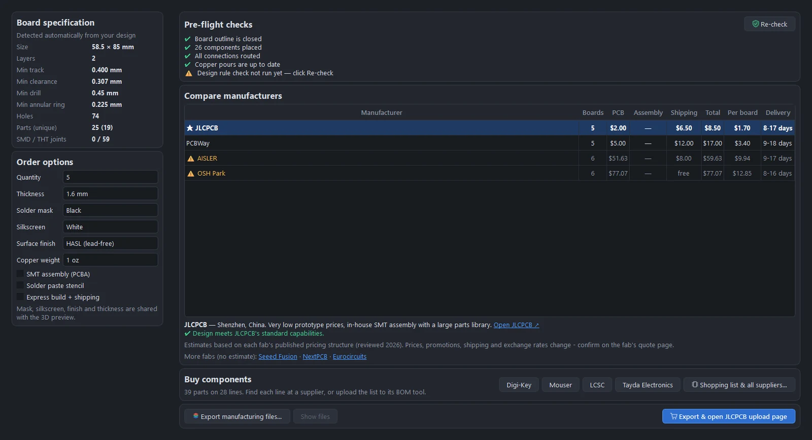

# Manufacturing and ordering

Turn the board into the files a fab needs, check it against what each fab can make, compare prices and delivery, and get to the upload page in one click.

## The Order & Manufacture tab

Open the **Order & Manufacture** tab, or click **Order** in the toolbar (Ctrl+Shift+O).

### Board specification

Detected from your design: the size, the number of layers, the smallest track, clearance, drill and annular ring, the number of holes, the parts (and unique parts), and the SMD and through-hole joint counts. These decide what each fab can make and what it costs.

### Order options

| Option | Choices |
|---|---|
| Quantity | 2 to 1,000 |
| Thickness | 0.6, 0.8, 1.0, 1.2, 1.6 or 2.0 mm |
| Solder mask | Green, red, blue, black, white, purple or yellow |
| Silkscreen | White or black |
| Surface finish | Lead-free HASL, HASL, ENIG or OSP |
| Copper weight | 1 oz or 2 oz |
| SMT assembly (PCBA) | Have the fab place the SMD parts |
| Solder paste stencil | |
| Express build + shipping | |

The mask, silkscreen, finish and thickness are the board's own settings, shared with the 3D view.

### Pre-flight checks

Before you export, PCBPro checks that:

- the board outline is closed;
- every component is placed;
- every connection is routed;
- the copper pours are up to date;
- the design rule check has been run and has no errors (**Re-check** runs it);
- with assembly ticked, every part has an MPN or an LCSC number.

### Compare manufacturers

| Fab | Where | Min track / space | Min drill | Layers | Notes |
|---|---|---|---|---|---|
| **JLCPCB** | Shenzhen, China | 0.127 mm | 0.3 mm | 1, 2, 4, 6 | Very low prototype prices, in-house SMT assembly with a large parts library |
| **PCBWay** | Shenzhen, China | 0.1 mm | 0.2 mm | 1, 2, 4, 6, 8 | Broad capabilities (flex, rigid-flex, advanced materials) and turnkey assembly |
| **OSH Park** | Oregon, USA | 0.152 mm | 0.254 mm | 2, 4 | US-made purple ENIG boards, priced per square inch in sets of three; free US shipping |
| **AISLER** | Aachen, Germany | 0.125 mm | 0.25 mm | 2, 4 | Made in Europe, green ENIG boards in sets of three; stencils and assembly |

For each fab the table shows the number of boards you get (some sell in sets), an estimated price for the boards, assembly and shipping, the total and per-board price, and the delivery time. A fab whose capabilities your board exceeds (a track too thin, a drill too small, a size too big, a colour or finish it doesn't offer) is marked with a warning, and selecting it says why.

Seeed Fusion, NextPCB and Eurocircuits are linked too, without estimates.

**Prices are estimates.** They come from each fab's published pricing structure (`pcbpro/fab/fabs.py`, reviewed in 2026), and fabs change prices, promotions, shipping and exchange rates often. The fab's own quote page is what you pay.

### Export and order

- **Export manufacturing files…** writes everything to a folder (by default `<name>_fab` next to the project).
- **Export & open … upload page** does the same, then opens the selected fab's upload page in your browser. Upload the zip there.
- **Show files** opens the folder.

None of these fabs offers a public ordering API, so PCBPro prepares the files and opens the upload page, and you upload and pay on the fab's site. **Always check the fab's own Gerber viewer before you pay.**

## The files

| File | Contents |
|---|---|
| `<name>.GTL`, `.GBL` | Top and bottom copper |
| `.G2`, `.G3` | Inner copper (4-layer boards) |
| `.GTS`, `.GBS` | Top and bottom solder mask |
| `.GTO`, `.GBO` | Top and bottom silkscreen |
| `.GTP`, `.GBP` | Top and bottom solder paste |
| `.GKO` | The board outline |
| `-PTH.drl`, `-NPTH.drl` | Excellon drill files, plated and unplated holes separately |
| `<name>_gerbers.zip` | All of the above, ready to upload |
| `<name>_BOM.csv` | The bill of materials, in JLCPCB's format: comment (value), designators, footprint, quantity, MPN and LCSC part number |
| `<name>_CPL.csv` | Pick-and-place: each part's designator, centre X and Y, layer and rotation, in JLCPCB's format |
| Pedals: drill template, Tayda coordinates, build sheet | See [Guitar pedals](pedals.md#drill-outputs) |

The Gerbers are RS-274X with X2 attributes (the generating software, the creation date, each file's function and polarity), using the Protel file extensions every fab recognises. The export is checked by the tests with an independent Gerber parser (pygerber), so a regression in the writer shows up before it reaches a fab.

## Assembly

JLCPCB, PCBWay and AISLER can assemble the board. For assembly:

1. Give every SMD part an LCSC number (parts from the catalogue and LCSC imports already have one) or an MPN.
2. Tick **SMT assembly (PCBA)**; the pre-flight check lists any part without one.
3. Upload the BOM and CPL files with the Gerbers.

Check the fab's placement preview: rotations of some packages differ between libraries, and the preview is where you catch a diode on backwards.

## Footprints and safety

- **Check footprints against datasheets.** Library land patterns follow IPC-7351 nominal sizes, and many are checked against KiCad's datasheet-based library (see [Checking footprints](library.md#checking-footprints-against-datasheets)), but the generic ones (the USB-C footprint, for one) need checking against the exact part you buy.
- **Amps.** A board with mains or high voltage needs more than a clean DRC: see [Amp boards and high voltage](amps.md#safety).
