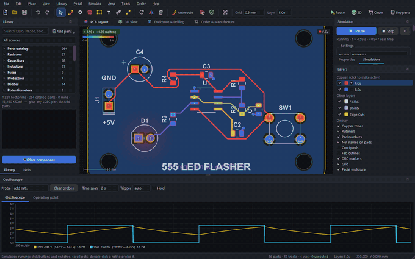
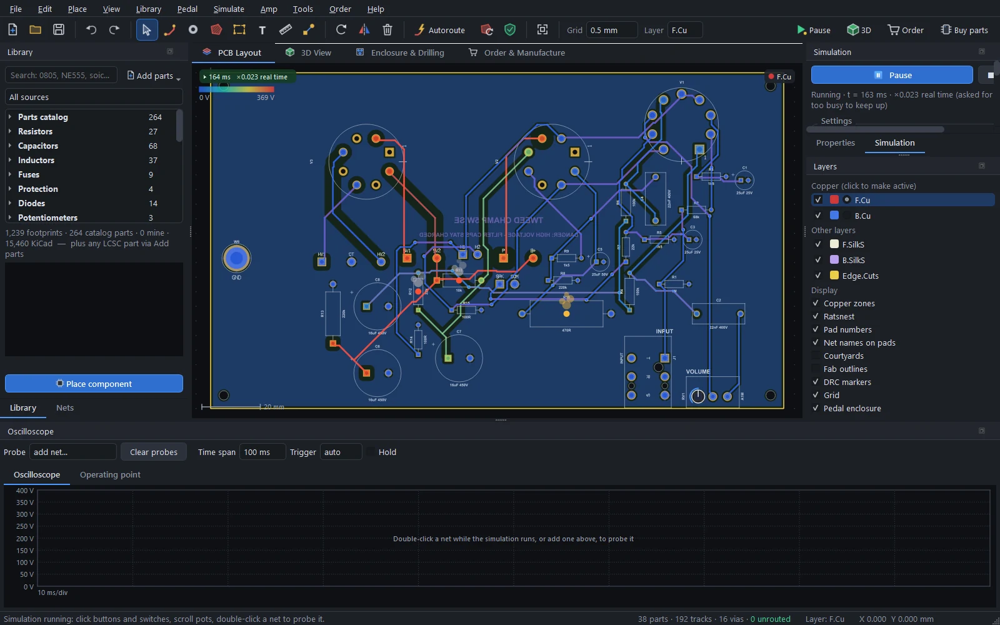

# Running the board

Press **Run** (F5) and the board comes alive: LEDs light and blink, copper is tinted by its voltage, overstressed parts start to smoke, and buttons, switches, pots and plugs work. Everything is simulated by PCBPro's own circuit solver, so no extra software is needed: analog parts, vacuum tubes, logic chips, and microcontrollers running your real compiled firmware.

 and the output (blue) on the oscilloscope.")

## Running and stopping

| Do this | To |
|---|---|
| **Run** (toolbar) or F5 | Start, pause and resume |
| Shift+F5 or Esc | Stop |
| **Simulate › Restart from power-up** | Start again from 0 V |
| Click a button or switch | Press it (hold the mouse button to hold a push-button) |
| Drag or scroll on a pot | Turn the knob |
| Double-click a net | Put it on the oscilloscope |

Editing the board stops the simulation. While it runs, the canvas tints each net's copper by its voltage, on the colour scale shown at the top left (0 V up to the highest supply), a lit LED glows in its colour, and parts run beyond their ratings (power, current, voltage) get a smoke marker. **Simulate › Clear smoke markers** clears them.

## The Simulation panel

The **Simulation** tab (next to Properties) controls the run:

- **Run, Stop and Restart**, and the status: the simulated time and how fast it runs against the clock.
- **Speed**: 1/1000 × to 5 × real time. Slow it down to watch a fast circuit, speed it up for a slow one.
- **Mode**: *As designed* simulates the netlist. *As built* follows the routed copper instead, so a missing track leaves its LED dark and a short really shorts.
- **Start**: power-up from 0 V (supplies ramp up, caps charge), or from the DC operating point (the circuit starts settled).
- **Run in a separate process** (on by default) keeps a busy solver or an emulated microcontroller from slowing the window down.
- **Sources**: the supplies and signal sources (see below), each with an on/off switch.
- **Controls**: every button, switch and pot on the board, with a **Hold to press** button, a position list or a slider.
- **Microcontrollers**: each chip's firmware, clock, **Load .hex…** and **Serial monitor** (see [Microcontrollers and firmware](firmware.md)).
- **Parts**: every part, how it's simulated (● simulated, ○ connection only, ✕ not simulated, – excluded), and warnings.
- **Audio**: **Play live…**, **Play through…** and **Frequency response…** (see [Playing guitar through it](audio.md)).

## The oscilloscope

Double-click a net while the simulation runs, or add it in the **Oscilloscope** dock's *Probe* box. The scope has:

- a trace per probe, drawn with its min/max envelope so fast edges aren't lost;
- a **time span** from 1 ms to 10 s per screen;
- a **trigger** (auto, rising or falling) to hold a repeating waveform still;
- **Hold** to freeze it;
- cursors, and a readout of each trace's voltage, its range and its frequency.

The **Operating point** tab lists every net's voltage and every part's power dissipation.

## Power and signal sources

Batteries, DC jacks and USB sockets on the board power it directly. Supplies that come from off the board are detected from net names and connectors (a `5V` or `VCC` net on a header becomes a 5 V bench supply, `9V` on a pedal's wire pads a 9 V supply). Pedal and amp inputs get a guitar-like test signal.

**Simulate › Power and signal sources…** shows and edits them: each source's net, its kind (DC, sine or square), its value, frequency and source resistance. Untick *Detect supplies automatically* to use only your own.

## What gets simulated

### Analog parts

- Resistors, capacitors (with polarity), inductors, pots at their knob position, and crystals.
- Diodes, Zeners, Schottkys and colour-correct LEDs (each colour's forward voltage).
- BJTs, MOSFETs and JFETs, including germanium transistors for fuzzes.
- Op-amps (LM358, TL072, NE5532, 4558 and more) and comparators.
- 555 and 556 timers.
- Linear regulators (78xx, LM317, AMS1117 and more) and voltage references.
- Opto-couplers, relays, sensors (LM35, TMP36, ACS712) and the LM386.
- Chip power amps (LM3886, LM1875, TDA2050, TDA2030) and bridge rectifiers.

About 220 real parts are in the model table by part number (63 transistors, 33 op-amps, 28 MOSFETs, 27 diodes, 20 regulators, 11 JFETs, 11 timers and more). Pinouts come from the manufacturers' datasheets; the few that weren't checked are marked ⚠ in the panel.

### Vacuum tubes

Triodes (12AX7, 12AT7, 12AU7, 12AY7, 5751, ECC88, 6SN7, 6SL7, 6C4), and pentodes and beam tetrodes (EL84, 6V6, 6AQ5, 6L6GC, 5881, KT66, EL34, KT88, 6550, EF86).

- Plate current follows Norman Koren's equations, with grid current, so overdriven stages show the blocking distortion of real amps, and the plate-grid Miller capacitance.
- Every type is calibrated to draw its datasheet current at the datasheet bias point, so bias voltages come out like a real amp's.
- Plate dissipation over the rating shows as smoke: red-plating.

### Amplifier boards

The off-board parts wired to an amp board's chassis pads are modelled too, so the board runs and plays as a whole amp:

- **Power supply.** Each rectified supply (B+, bias, ± rails, DC heaters) becomes a DC source with the rectifier's source resistance. B+ sags under load, but there's no mains hum, and the rectifier parts are left out.
- **Output transformer.** Its primary impedance comes from the design, or from the power tubes and topology. The model includes the magnetising and leakage inductance, the winding resistance and its damped winding capacitance.
- **Feedback polarity.** If the design doesn't say which way round the secondary goes, PCBPro tries both and keeps the one that gives negative feedback, as a builder would.
- **Speaker.** A real speaker's impedance, with its bass resonance and voice-coil inductance. A pentode output stage follows that curve, which is part of the tube-amp sound.
- **Other parts.** A filter choke on the choke pads. An effects loop's RETURN jack starts unplugged, so the loop passes through.

### Logic

74HC, 74LVC and CD4000 gates, flip-flops, counters (CD4017, CD4060), shift registers (74HC595, 74HC165), decoders, the 4051 analog multiplexer and the L293D. The ULN2003 and ULN2803 are built from Darlington pairs. Inputs switch at thresholds relative to the chip's own supply, with hysteresis on Schmitt-trigger parts, and outputs are push-pull stages with a realistic output resistance or high impedance.

### Microcontrollers

The ATmega328P (and 48, 88, 168), the ATtiny85, 45, 25 and 13A, and the Arduino Nano and Pro Mini modules run your real compiled firmware. See [Microcontrollers and firmware](firmware.md).

## Part models

PCBPro decides what each part is from, in order: your override for that part, the model table (matched on the MPN or the value), and then the reference prefix, footprint and value (an `R` with a value is a resistor, a `D` valued `Red` is a red LED). Anything else is *unsupported*: drawn hatched, with its pins left open.

Double-click a part in the Simulation panel, or use **Simulate › Simulation model of the selected part…**, to choose another model, set its parameters, or fix its pin mapping.

## Not simulated

Switching regulators, other microcontrollers, and I2C or SPI peripherals are shown hatched and left open. Mains, the transformer primary and anything off the board except what's described above aren't simulated either.

## Speed

Analog circuits run in real time on a typical PC. A busy 16 MHz AVR plus its circuit runs at about a third of real time; firmware that sleeps runs faster. The panel shows the live speed, and timing inside the simulation is exact: `delay(500)` is 500 ms of circuit time, whatever the clock on the wall says.

For audio, a different engine compiles the circuit into a model that runs many times faster than real time: see [Playing guitar through it](audio.md).

## How it works

A modified-nodal-analysis engine with adaptive time steps solves the circuit, with Newton iterations for the nonlinear parts and exact landing on switching events (a 555's threshold, a logic edge, a firmware pin change). See [How it works](how-it-works.md#the-circuit-simulator).
