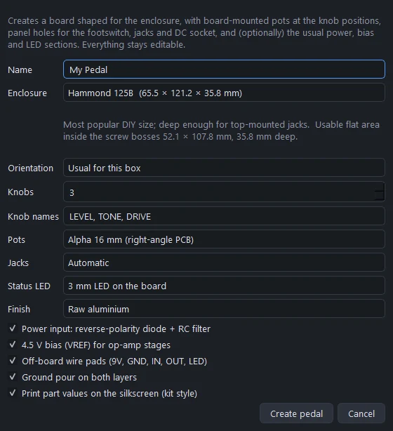
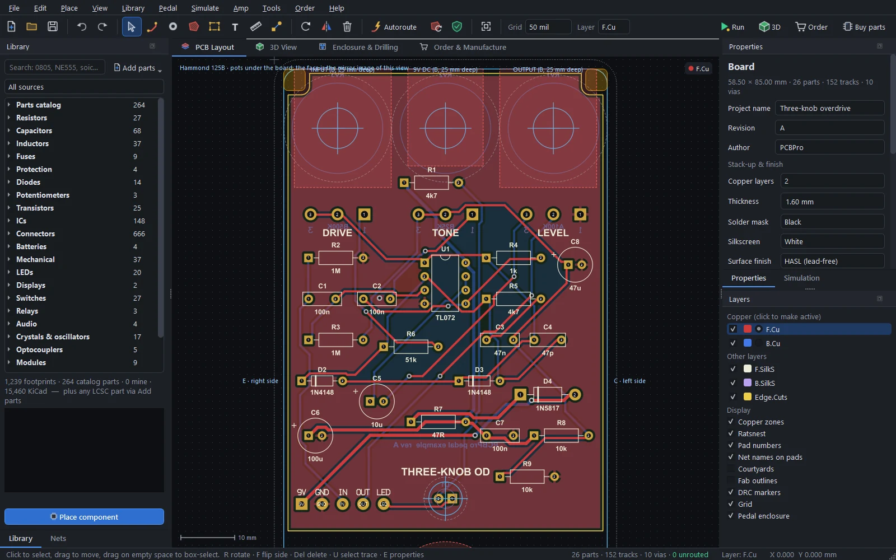
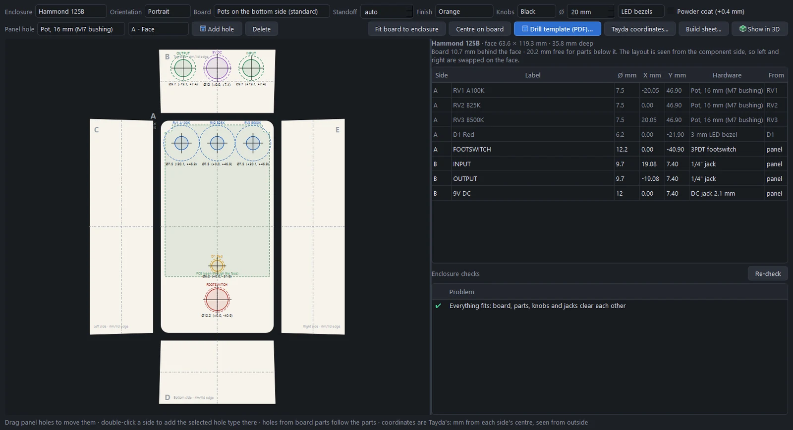
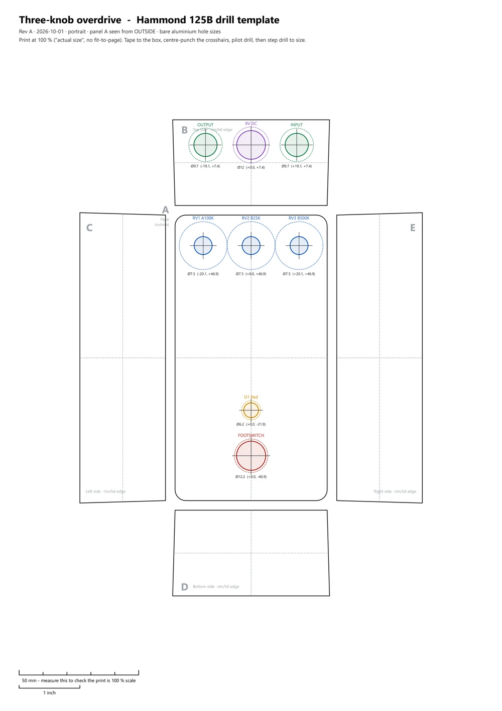
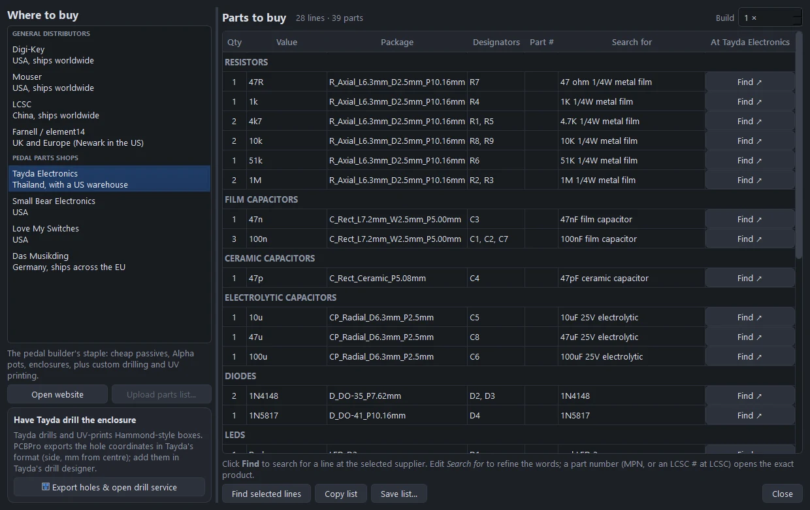

# Tutorial: your first pedal

Build a three-knob op-amp overdrive in a Hammond 125B, from an empty enclosure to a board you can order and a box you can drill. It takes about 45 minutes. The finished pedal ships with PCBPro as **Pedal › Open example: three-knob overdrive**, so you can open it at any point to compare.

You'll use most of PCBPro on the way: the new-pedal wizard, the parts library, the Connect tool, the autorouter, the design rule check with its enclosure checks, the drill template, the 3D view, the simulator and the order page.

## The circuit

A classic op-amp overdrive on a single 9 V supply, with a 4.5 V bias rail (VREF) for the op-amp:

| Stage | Parts |
|---|---|
| Input | 1M pull-down from IN to ground, 100n coupling cap to the op-amp input, 1M bias resistor to VREF |
| Gain | TL072 section A as a non-inverting amplifier: 4k7 + 47n to VREF, 51k plus the DRIVE pot (B500K) in the feedback path, a 47p roll-off cap and a pair of 1N4148 diodes across it for soft clipping |
| Tone | 1k in series, then 100n and the TONE pot (B25K, as a variable resistor) to VREF: a treble cut |
| Output | TL072 section B as a buffer, a 10u coupling cap and the LEVEL pot (A100K) as a volume control |
| Power | 1N5817 against reverse polarity, 47R with 100u and 100n as a filter, 10k / 10k / 47u for VREF, and a resistor for the status LED |

The wizard builds the power, VREF and LED sections for you. You add the rest.

## 1. Start the pedal

**Pedal › New pedal…** (Ctrl+Shift+N), or **New pedal…** on the start screen.

Fill it in like this:

| Setting | Value |
|---|---|
| Name | Three-knob OD |
| Enclosure | Hammond 125B (65.5 × 121.2 × 35.8 mm) |
| Orientation | Usual for this box (portrait) |
| Knobs | 3, named `LEVEL, TONE, DRIVE` |
| Pots | Alpha 16 mm (right-angle PCB) |
| Jacks | Automatic |
| Status LED | 3 mm LED on the board |
| Finish | Orange |

Leave the five options ticked: the power input with its reverse-polarity diode and filter, the 4.5 V bias, the off-board wire pads, a ground pour on both layers, and part values printed on the silkscreen. Click **Create pedal**.

## 2. Look at what you got

The wizard drew a board shaped for the inside of the box: it's notched around the four lid-screw bosses and stops short of the footswitch and the jacks. On it are:

- three Alpha 16 mm pots at the knob positions, their names printed above them;
- a 3 mm LED where the status light goes;
- the power input (1N5817, 47R, 100u, 100n), the VREF divider (10k, 10k, 47u) and the LED resistor;
- a strip of wire pads at the bottom edge: **9V, GND, IN, OUT, LED**, for the wires to the DC socket, the jacks and the footswitch;
- a ground pour on both layers.

The thin outlines around the board are the enclosure: the cavity, the screw bosses, and keep-outs where panel hardware (the footswitch, the jacks, the DC socket) hangs behind the face. The note at the top left says the pots are under the board, so the face of the box sees the board from behind; PCBPro mirrors every drill coordinate for you (see [mirroring](pedals.md#mirroring-handled-for-you)).

Set the grid to 1.27 mm (the toolbar's **Grid** box). Through-hole parts line up on it.

## 3. Add the parts

Search the Library and place each part with **Place component** (or **P**), clicking on the board where it should go. **R** rotates it before you click. Leave the area between the pots and the wire pads for the circuit.

| What | Search for | Value |
|---|---|---|
| The op-amp | `DIP-8` (or `TL072` in the parts catalog) | TL072 |
| 1/4 W resistors | `resistor axial` | 1M, 1M, 4k7, 51k, 1k |
| Film caps | `film` | 100n, 100n, 47n |
| The ceramic cap | `ceramic` | 47p |
| The electrolytic | `electrolytic radial` | 10u |
| Two signal diodes | `DO-35` | 1N4148 |

Set each part's value in **Properties** (E). The Value box suggests the standard E24 resistor and E6 capacitor values as you type. The value is printed next to the part on the silkscreen, the way pedal kits are.

To get a feel for the size of things, put the TL072 in the middle below the pots, the input parts to its left, the gain parts to its right and the output parts below it. You can move anything later: dragging a part drags its tracks along.

## 4. Connect them

PCBPro has no separate schematic: you make the netlist on the board. Two ways:

- **The Connect tool** (**N**). Click a pad, then another: they're now on the same net. Click a third to add it. The net gets a name like `N$12`; you can rename it in the Nets panel.
- **Pad nets in Properties.** Select a part and type or pick a net name for each pad. This is the quickest way to put pads on existing nets such as `VREF`, `GND` or `IN`.

The wizard already wired the power section, VREF, the LED and the wire pads (`9V`, `GND`, `IN`, `OUT`, `LED`, `V+`, `VREF`). The pots are still unconnected. Wire the rest from this list, which is the netlist of the bundled example:

| Net | Pads |
|---|---|
| `IN` | wire pad IN, 1M (to GND), 100n coupling cap |
| `NIN` | 100n coupling cap, 1M (to VREF), TL072 pin 3 |
| `FB1` | TL072 pin 2, 4k7, 51k, 47p, both 1N4148 (one anode, one cathode) |
| `GN` | 4k7, 47n (other end to VREF) |
| `DRV` | 51k, DRIVE pot pin 1 |
| `OA1` | TL072 pin 1, DRIVE pot pins 2 and 3, 47p, both 1N4148 (the other ends), 1k |
| `TONE` | 1k, 100n tone cap, TL072 pin 5 |
| `TONE_C` | 100n tone cap, TONE pot pin 1 |
| `VREF` | TONE pot pins 2 and 3, the 1M bias resistor, the 47n gain cap |
| `OB` | TL072 pins 6 and 7, 10u (+) |
| `VOL` | 10u (-), LEVEL pot pin 3 |
| `OUT` | LEVEL pot pin 2 |
| `V+` | TL072 pin 8, and the power section's filtered supply |
| `GND` | TL072 pin 4, LEVEL pot pin 1, the 1M input pull-down |

Thin lines (the ratsnest) appear between the pads of each net, showing what's left to route. Click a net in the **Nets** panel to highlight it on the board.

## 5. Route it

Press **Autoroute** in the toolbar (Ctrl+Shift+A). The defaults suit a pedal: an automatic grid, normal via usage, and the ground connected last with short stubs into the pour. Click **Start routing**.

When it finishes, the pours refill around the new tracks and the status bar should say **0 unrouted**. If a connection fails, move a part to open a gap and run it again, or route it yourself: press **X**, click a pad, click your way to the other pad (**V** drops a via to the other side), and double-click to finish.

## 6. Check it

**Pedal › Run DRC with enclosure checks** (F8). Besides the usual clearances, shorts, drill sizes and unrouted connections, a pedal gets [enclosure checks](pedals.md#enclosure-checks): the board fits the cavity and clears the bosses, every part fits in the gap between the board and the face (and below the board, down to the lid), the pots are on the right side, and the knobs, nuts, jacks and DC socket don't collide.

Click a problem in the list to zoom to it. Fix everything marked as an error before you order.

## 7. The drill template

Open the **Enclosure & Drilling** tab.

The box is drawn unfolded, the way Tayda's drill service describes it: the face (A) in the middle, the top wall (B) above it with the jacks and the DC socket, the side walls (C and E) left and right, and the bottom wall (D). Holes for the pots and the LED come from the board itself and follow the parts; the footswitch, jacks and DC socket are panel holes the wizard added. The table lists every hole with its diameter and its coordinates in mm from the centre of its side.

From here:

- **Drill template (PDF)…** writes a 1:1 printable template with crosshairs, a coordinate table, and a 50 mm and 1 inch scale bar to check that your printer didn't scale it. Print it at 100 %, tape it to the box and centre-punch through the crosshairs.

  

- **Tayda coordinates…** writes the same holes in the format Tayda's drill designer takes, if you'd rather have the box drilled for you.
- **Build sheet…** writes the parts list grouped the way pedal builders shop, including the box, knobs, footswitch, jacks and DC socket.

## 8. See it in 3D

**Pedal › Show the pedal in 3D**. The 3D view draws the box in its finish with the knobs, the footswitch, the LED and the jack nuts, the right way up even though the pots hang under the board. Drag to orbit, right-drag to pan, scroll to zoom. Turn the box over to see the board inside it; tick **Base plate** to close it.

## 9. Hear it

PCBPro can play guitar through the circuit before you build it.

**Simulate › Audio play-through…** renders a guitar clip (synthesised, or your own WAV) through the board, with the three knobs as sliders. **Render**, then **▶ Dry** and **▶ Processed** to compare. Turn DRIVE up and render again; the frequency-response plot follows the knobs as you move them.

With an audio interface, **Simulate › Play live** (Ctrl+Shift+L) plays your own guitar through the circuit in real time, with about 10 ms of latency. See [Playing guitar through it](audio.md).

You can also just **Run** it (F5): the LED lights, and double-clicking a net puts it on the oscilloscope. See [Running the board](simulation.md).

## 10. Order the board and the parts

Open the **Order & Manufacture** tab.

The left column shows what PCBPro found in your design: the board size, the smallest track, clearance and drill, the number of holes and joints. Set the quantity and the solder mask, silkscreen and finish (they also colour the 3D view). The pre-flight checks must all be green. The table compares estimated prices and delivery times from JLCPCB, PCBWay, OSH Park and AISLER, and marks any fab whose capabilities your board exceeds.

Click **Export & open … upload page**. PCBPro writes the Gerbers, the drill files and the BOM and pick-and-place files to a `<name>_fab` folder next to your project, zips the Gerbers and drills, and opens the fab's upload page. Upload the zip there and check the fab's own Gerber viewer before you pay.

For the parts, click **Buy parts** in the toolbar (Ctrl+Shift+B), pick **Tayda Electronics** and click **Find** on each line.

**Have Tayda drill the enclosure** exports the hole coordinates and opens Tayda's drilling service. See [Buying components](buying-parts.md).

## 11. Wire it up

When the board and parts arrive: solder the low parts first (resistors, diodes), then the sockets and caps, and the pots last, from the back of the board so their shafts point through the face. Put the board in the box, nut the pots to the face, and run wires from the pads:

- **9V** and **GND** to the DC socket (centre negative),
- **IN** and **OUT** to the footswitch's true-bypass wiring, with the input and output jacks on the other poles,
- **LED** to the footswitch's third pole, so the LED lights when the effect is on.

## Where next

- [Guitar pedals](pedals.md): every enclosure, the drilling tools and the checks in detail.
- [The layout editor](layout.md): routing by hand, pours, net classes and the design rule check.
- [The parts library](library.md): importing any LCSC part, KiCad libraries and the footprint wizard.
- [High-gain amps and pedals](high-gain.md): the Tight Boost, the Noise Gate and the High-Gain Distortion.
